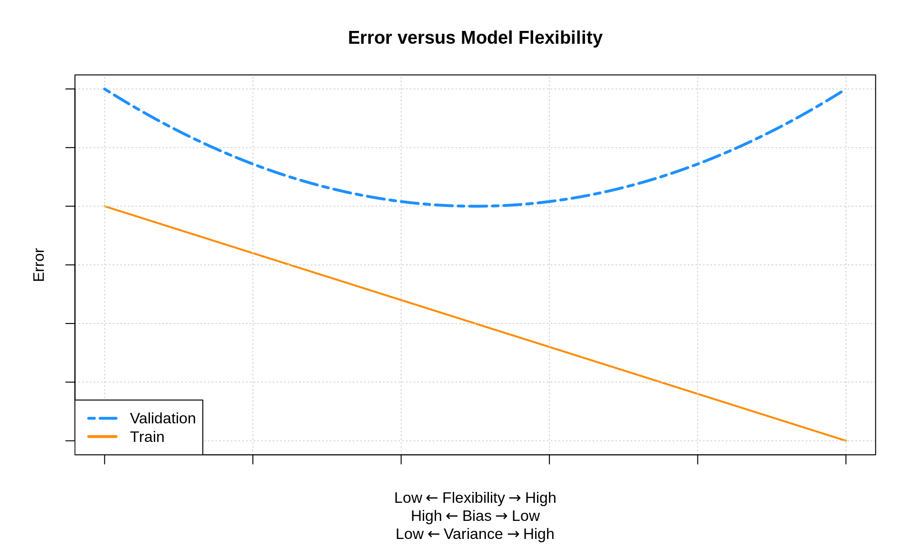

# Regression Overview

***

This chapter will provide an overview of the **regression** concepts that we have learned thus far. It will also serve to outline the general concepts of **supervised learning** which will also apply to our next task, *classification.*

The information here may eventually be merged into the previous chapter, but for now it is separated for clarify. (Also, much of this information already appears there.)

***

## Goal

What is the goal of regression models in the context of machine learning? We can discuss it in two ways:

- Make **predictions** on *unseen data*.
- Estimate the **regression function**, which under squared error loss is the *conditional mean* of $Y$, the response, given $X$, the features.

These goal are essentially the same. We want to fit a model that "generalizes" well, that is, works well on unseen data. To do this, we want to use a model of appropriate **flexibility** so as not to **overfit** to the train data. In other words, we want to train a models that learns the **signal**, the regression function, and not the **noise**, the random variation in the training data.

In previous chapters we have formalized this goal a bit more mathematically, but for a general recap, we stick to more casual language.

***

## Strategy

How do we find and train models that generalize well to unseen data? We generally follow these steps.

1. *Split* the data in to **training data** and **testing data**.
    - Within the training data, we will do whatever we would.
    - The testing data will never be used to make any decision that lead to the selection of a model.
    - We often use 80% of the available data for training.
2. *Split* the training data into **estimation data** and **validation data**.
    - We often use 80% of the available data for estimation.
3. *Decide* on a set of **candidate models**.    
4. *Fit* (train) each candidate model to the **estimation data**.
5. *Evaluate* all candidate models fit to the estimation data based on their performance on the **validation data**.
    - Performance here is based on the ability of the model to predict on the validation data which was **not** used to train the models.
6. *Select* one of the candidate models based on the **validation performance**.
7. *Fit* the chosen model to the entire **training dataset**.
8. *Estimate* model performance using the **test data**.

Note that we are using the **validation data** to *select* a model, while the **test data** is used to *estimate model performance*.

**

## Models

While there are many, many models that can be used for regression, we have focused on three **families** of models. We saw how each can be used to estimate the regression function. Importantly, each model family can be made more or less flexible to accommodate different datasets in order to find a model that predicts well.

#### Linear Models

**Linear models** are a family of **parametric** models which assume that the regression function is a linear combination of the features. For example, with a single feature $x$, we could assume

$$
\mu(x) = \beta_0 + \beta_1 x + \beta_2 x^2 + \beta_3 x^3 + \ldots + \beta_9 x^9
$$

Here, the $\beta$ coefficients are *model parameters* that are learned from the data via least squares or maximum likelihood. (Additionally, we could assume a conditional normal distribution with a constant variance, which would require estimating the $\sigma$ parameters. This is not necessary to estimate the mean.)

#### k-Nearest Neighbors

**k-Nearest Neighbors** models are a family of **nonparametric models** with a single *tuning parameter*, $k$, the number of neighbors to use when estimating the regression function. We can also control which features are used when measuring distances.

#### Decision Trees

**Decision Tree** models are a family of **nonparametric models** with a number of *tuning parameters*, but most notably, `cp`, the "complexity parameter" which indirectly controls the number of splits used to create neighborhoods of observations. We can also control which features are used when considering splits.

## Model Flexibility

While we may not have explicitly stated this relationship, the plot below shows how train and validation "error" change as a function of model flexibility.

The "error" in this plot could be any reasonable error metric used, for example, RMSE. While here we are specifically discussing estimation and validation error, we more generally are discussing an error metric calculated on the same data used to train the model (estimation) and an error metric calculated on data **not** used to train the model, for example the validation data.

The "line" and "curve" seen above are highly idealized, that is, you won't see nice linear and quadratic trends in practice. However, you will see that *training error* **decreases** as *model flexibility* **increases**. (This is essentially one of the few use cases for actually calculating training error, to verify this relationship as a sanity check.) On the other hand, often we will see that *validation error* first **decreases**, then **increases** as *model flexibility* **increases**. (Sometimes you might see only an increase or decrease which would suggest you need to also try additional models with more or less flexibility.) While the validation "curve" is idealized as a "curve" that decrease then increases, in practice, it might be a bit more "wiggly" just due to the random nature of the validation split.

How can we modify the flexibility of the models we have considered?

#### Linear Models

To increase the flexibility of linear models, add additional transformed features or simply add features.

For example a model that assumes a quadratic mean function

$$
\mu_1(x) = \beta_0 + \beta_1 x + \beta_2 x ^ 2
$$

is more flexible than a model that assumes a linear mean function

$$
\mu_2(x) = \beta_0 + \beta_1 x
$$

The model that assumes a quadratic mean function **can** learn a linear mean function, but this added flexibility comes with a price. (Possible overfitting.)

Similarly, a model that assumes the mean function is a function of two features

$$
\mu_1(x) = \beta_0 + \beta_1 x_1 + \beta_2 x_2
$$

is more flexible than a model that assumes the mean function is only a function of one of these features.

$$
\mu_2(x) = \beta_0 + \beta_1 x
$$

#### k-Nearest Neighbors

Given a set of feature variables, as $k$ increases, model flexibility **decreases.** (Note that adding and removing features does have an effect on model flexibility, generally adding flexibility with additional features, there are situations where adding features will decrease training error.)

#### Decision

Given a set of feature variables, as `cp` increases, model flexibility **decreases.** (Note that adding and removing features does have an effect on model flexibility, generally adding flexibility with additional features, there are situations where adding features will decrease training error.)

## Overfitting

Overfitting occurs when we have fit to not just the **signal** but also the **noise.** That is, a model performs too well on the training data.

Let's take a look at this visually.

In each of the plots above, the dashed black curve represents the true mean function of interest, in this case,

$$
\mu(x) = \sin(x)
$$

with points simulated about this mean according to a standard normal. (This is the noise is standard normal.)

We see that the model with $k = 1$ has fit far too well to the training data. The estimated mean function, seen in green, goes through each training point. That is, there is no training error. This model is **too flexible** and is **overfitting**. We have learned **both** the signal and the noise, thus this model will predict poorly on new data.

The model with $k = 25$ has fits the training data poorly. The estimated mean function, seen in red, does not match the true mean function well. The points are far from the estimated mean function. his model is **too inflexible** and is **underfitting**. It has learned neither the signal not the noise.

The model with $k = 5$ seems like a reasonable in-between. Doesn't seem to be chasing noise. Seems to reasonably approximate the true mean function.

How do we assess over and underfitting in practice, when we don't know the true mean function? We have to look at train and validation errors.

- Model that are probably **underfitting**: "Large" Train RMSE and a Validation RMSE larger than the smallest. The less flexible, the more probable the underfitting.
- Model that are probably **overfitting**: "Small" Train RMSE and a Validation RMSE larger than the smallest. The more flexible, the more probable the overfitting.

The further a model is to the *left* of this plot, the greater the chance it is **underfit**. The further a model is to the *right* of this plot, the greater the chance it is **overfit**.

## Bias-Variance Tradeoff

**Why** does changing the model flexibility influence the predictive performance of these models? The bias-variance tradeoff.

As models *increase* in **flexibility**, 

- **bias** is *decreased*
- **variance** is *increased*

And together, the MSE is equal to the bias squared plus the variance.

However, the rate at which the variance increases can be and generally is different than the rate at which the bias deceases. This is why we must validate our models. Essentially, by modifying the model complexity and validating the results, we are trying to find the right balance between bias and variance.

***

## Source

- `R` Markdown: [`09-regression-overview.Rmd`](09-regression-overview.Rmd)

***
