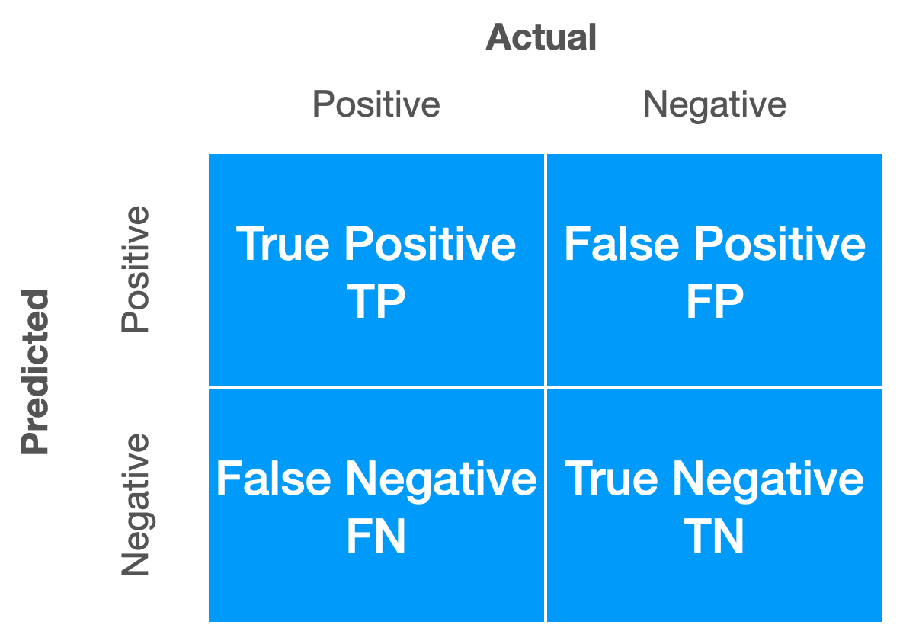
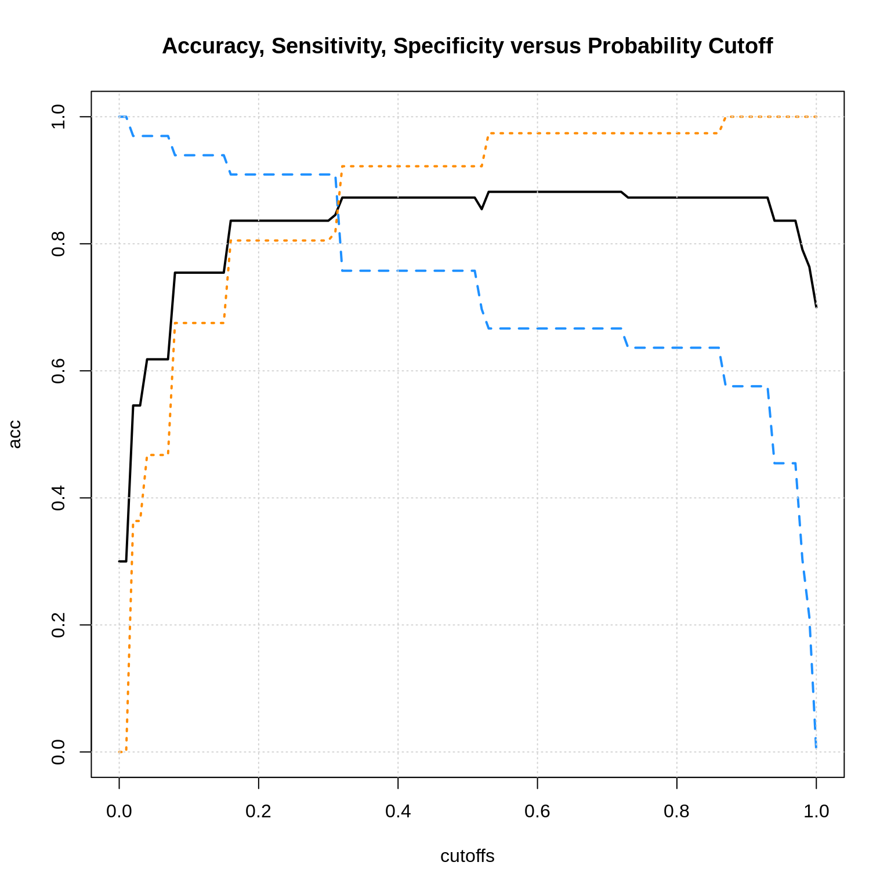

# Binary Classification


This chapter will introduce no new modeling techniques, but instead will focus on evaluating models for **binary classification.**

Specifically, we will discuss:

- Using a **confusion matrix** to summarize the results of a binary classifier.
- Various metrics for binary classification, including but not limited to: **sensitivity**, **specificity**, and **prevalence**.
- Using different **probability cutoffs** to create different classifiers with the same model.

This chapter is currently **under construction**. While it is being developed, the following links to the STAT 432 course notes.

- [**Notes:** Binary Classification](files/binary-classification.pdf)

## R Setup and Source


```r
library(ucidata)    # access to data
library(tibble)     # data frame printing
library(dplyr)      # data manipulation

library(caret)      # fitting knn
library(rpart)      # fitting trees
```

Recall that the [Welcome](index.html) chapter contains directions for installing all necessary packages for following along with the text. The R Markdown source is provided as some code, mostly for creating plots, has been suppressed from the rendered document that you are currently reading.

- **R Markdown Source:** [`binary-classification.Rmd`](binary-classification.Rmd)

## Breast Cancer Data


```r
devtools::install_github("coatless/ucidata")
```


```r
# load data
bc = na.omit(tibble::as_tibble(bcw_original))
```


```r
# data prep
bc = bc %>%
  dplyr::mutate(class = factor(class, labels = c("benign", "malignant"))) %>%
  dplyr::select(-sample_code_number)
```

For this example, and many medical testing examples, we will refer to the diseased status, in this case `"Malignant"` as the "Positive" class. Note that this is a somewhat arbitrary choice.


```r
# set seed
set.seed(42)
```


```r
# test-train split
bc_trn_idx = sample(nrow(bc), size = 0.8 * nrow(bc))
bc_trn = bc[bc_trn_idx, ]
bc_tst = bc[-bc_trn_idx, ]
```


```r
# estimation-validation split
bc_est_idx = sample(nrow(bc_trn), size = 0.8 * nrow(bc_trn))
bc_est = bc_trn[bc_est_idx, ]
bc_val = bc_trn[-bc_est_idx, ]
```


```r
# check data
head(bc_trn)
```

```
## # A tibble: 6 x 10
##   clump_thickness uniformity_of_c… uniformity_of_c… marginal_adhesi…
##             <int>            <int>            <int>            <int>
## 1               5                1                2                1
## 2               8                6                7                3
## 3               1                2                2                1
## 4               1                1                2                1
## 5              10                4                5                5
## 6               8                8                7                4
## # … with 6 more variables: single_epithelial_cell_size <int>,
## #   bare_nuclei <int>, bland_chromatin <int>, normal_nucleoli <int>,
## #   mitoses <int>, class <fct>
```


```r
# inspect response variable
levels(bc_trn$class)
```

```
## [1] "benign"    "malignant"
```

Note that in this case, the positive class also corresponds to the class that logistic regression would view as $Y = 1$ which makes things somewhat simplier to discuss, but these do not actually need to be aligned.

## Confusion Matrix


```r
# fit models
mod_tree = rpart(class ~ clump_thickness + mitoses, data = bc_est)
```


```r
# obtain prediction using tree for validation data
pred_tree = predict(mod_tree, bc_val, type = "class")
```




```r
tp = sum(bc_val$class == "malignant" & pred_tree == "malignant")
fp = sum(bc_val$class == "benign"    & pred_tree == "malignant")
fn = sum(bc_val$class == "malignant" & pred_tree == "benign")
tn = sum(bc_val$class == "benign"    & pred_tree == "benign")
```


```r
c(tp = tp, fp = fp, fn = fn, tn = tn)
```

```
## tp fp fn tn 
## 24  7  9 70
```


```r
# note that these are not in the same positions are the image above
# that is OK and almost expected!
table(
  predicted = pred_tree,
  actual = bc_val$class
)
```

```
##            actual
## predicted   benign malignant
##   benign        70         9
##   malignant      7        24
```


```r
n_obs = nrow(bc_val)
pos = tp + fn
neg = tn + fp
```


```r
c(n_obs = n_obs, pos = pos, neg = neg)
```

```
## n_obs   pos   neg 
##   110    33    77
```

## Binary Classification Metrics

First, before we introduce new metrics, we could re-define previous metrics that we have seen as functions of true and false positives and negatives. Note, we will use $P$ for number of actual positive cases in the dataset under consideration, and $N$ for the number of actual negative cases.

$$
\text{Accuracy} = \frac{\text{TP + TN}}{\text{TP + FP + TN + FN}} = \frac{\text{TP + TN}}{\text{P + N}}
$$


```r
(acc = (tp + tn) / (tp + fp + tn + fn))
```

```
## [1] 0.8545455
```

```r
(acc = mean(bc_val$class == pred_tree))
```

```
## [1] 0.8545455
```

Here we pause to introduce the **prevalence** and the **no information rate**.

$$
\text{Prevalence} = \frac{\text{P}}{\text{P + N}}
$$


```r
(prev = pos / (pos + neg))
```

```
## [1] 0.3
```

```r
(prev = pos / n_obs)
```

```
## [1] 0.3
```


$$
\text{No Information Rate} = \max\left(\frac{\text{P}}{\text{P + N}}, \frac{\text{N}}{\text{P + N}}\right)
$$


```r
(nir = max(c(pos / (pos + neg), neg / (pos + neg))))
```

```
## [1] 0.7
```

```r
(nir = max(c(prev, 1 - prev)))
```

```
## [1] 0.7
```

The prevalence tells us the proportion of the positive class in the data. This is an important baseline for judging binary classifiers, especially as it relates to the no information rate. The no information rate is essentially the proportion of observations that fall into the "majority" class. If a classifier does not achieve an accuracy above this rate, the classifier is performing worse than simply always guessing the majority class!

$$
\text{Misclassification} = \frac{\text{FP + FN}}{\text{TP + FP + TN + FN}} = \frac{\text{FP + FN}}{\text{P + N}}
$$


```r
(mis = (fp + fn) / (tp + fp + tn + fn))
```

```
## [1] 0.1454545
```

```r
(mis = mean(bc_val$class != pred_tree))
```

```
## [1] 0.1454545
```

Beyond simply looking at accuracy (or misclassification), when we are specifically concerned with binary classification, there are many more informative metrics that we could consider.

First, **sensitivity** or **true positive rate** (TPR) looks at the number of observations correctly classified to the positive class, divided by the number of positive cases. In other words, how many of the positive cases did we detect?

$$
\text{Sensitivity} = \text{True Positive Rate} = \frac{\text{TP}}{\text{P}} = \frac{\text{TP}}{\text{TP + FN}}
$$


```r
(sens = tp / (tp + fn))
```

```
## [1] 0.7272727
```

A related but somewhat opposite quantity is the **specificity** or **true negative rate**. (TNR)

$$
\text{Specificity} = \text{True Negative Rate} = \frac{\text{TN}}{\text{N}} = \frac{\text{TN}}{\text{TN + FP}}
$$


```r
(spec = tn / (tn + fp))
```

```
## [1] 0.9090909
```

While we obviously want an accurate classifier, sometimes we care more about sensitivity or specificity. For example, in this cancer example, with `"Malignant"` as the "positive" class, do we care more about sensitivity or specificity?

From here, we could define many, many more metrics for binary classification. We first note that there are several easy-to-read Wikipedia articles on this topic.

- [Wikipedia: Confusion Matrix](https://en.wikipedia.org/wiki/Confusion_matrix)
- [Wikipedia: Sensitivity and Specificity](https://en.wikipedia.org/wiki/Sensitivity_and_specificity)
- [Wikipedia: Precision and Recall](https://en.wikipedia.org/wiki/Precision_and_recall)
- [Wikipedia: Evaluation of Binary Classifiers](https://en.wikipedia.org/wiki/Evaluation_of_binary_classifiers)

As a STAT 432 student you aren't responsible for memorizing all of these, but based on how their definitions relate to true and false positives and negatives you should be able to calculate any of these metrics.

A few more examples:

$$
\text{Positive Predictive Value} = \text{Precision} = \frac{\text{TP}}{\text{TP + FP}}
$$


```r
(ppv = tp / (tp + fp))
```

```
## [1] 0.7741935
```

$$
\text{Negative Predictive Value} = \frac{\text{TN}}{\text{TN + FN}}
$$


```r
(npv = tn / (tn + fn))
```

```
## [1] 0.8860759
```


$$
\text{False Discovery Rate} = \frac{\text{FP}}{\text{TP + FP}}
$$


```r
(fdr = fp / (tp + fp))
```

```
## [1] 0.2258065
```

What if we cared more about some of these metrics, and want to make our classifiers better on these metrics, possibly at the expense of accuracy?

## Probability Cutoff

Recall that we use the notation

$$
\hat{p}(x) = \hat{P}(Y = 1 \mid X = x).
$$

And in this example because it is the second level of the response variable, `"malignant"` is considered $Y = 1$. (It also is coincidentally the positive class.)

$$
\hat{C}(x) = 
\begin{cases} 
      1 & \hat{p}(x) > 0.5 \\
      0 & \hat{p}(x) \leq 0.5 
\end{cases}
$$

First let's verify that directly making classifications in R is the same as first obtaining probabilities, and then comparing to a cutoff.


```r
# fit tree model
mod_tree = rpart(class ~ clump_thickness + mitoses, data = bc_est)
```


```r
# obtain prediction using tree for validation data
pred_tree = predict(mod_tree, bc_val, type = "class")
```


```r
head(predict(mod_tree, bc_val, type = "prob"))
```

```
##       benign malignant
## 1 0.08547009 0.9145299
## 2 0.88235294 0.1176471
## 3 0.88235294 0.1176471
## 4 0.88235294 0.1176471
## 5 0.88235294 0.1176471
## 6 0.88235294 0.1176471
```


```r
prob_tree = predict(mod_tree, bc_val, type = "prob")[, "malignant"]
```


```r
all.equal(
  factor(ifelse(prob_tree > 0.5, "malignant", "benign")),
  pred_tree)
```

```
## [1] TRUE
```

Now let's switch to using logistic regression. (This is just to make a graph later slightly nice for illustrating a concept.)


```r
mod_glm = glm(class ~ clump_thickness + mitoses, data = bc_est, family = "binomial")
prob_glm = predict(mod_glm, bc_val, type = "response")
pred_glm = factor(ifelse(prob_glm > 0.5, "malignant", "benign"))
```

We fit the model, obtain probabilities for the `"malignant"` class, then make predictions with the usual cutoff.

We then calculate validation accuracy, sensitivity, and specificity.


```r
tp = sum(bc_val$class == "malignant" & pred_glm == "malignant")
fp = sum(bc_val$class == "benign"    & pred_glm == "malignant")
fn = sum(bc_val$class == "malignant" & pred_glm == "benign")
tn = sum(bc_val$class == "benign"    & pred_glm == "benign")

c(acc = (tp + tn) / (tp + fp + tn + fn),
  sens = tp / (tp + fn), 
  spec = tn / (tn + fp))
```

```
##       acc      sens      spec 
## 0.8727273 0.7575758 0.9220779
```

What if we change the cutoff? 

$$
\hat{C}(x) = 
\begin{cases} 
      1 & \hat{p}(x) > \alpha \\
      0 & \hat{p}(x) \leq \alpha 
\end{cases}
$$

For example, if we raise the cutoff, the classifier is going to clasify to `"malignant"` less often. So we can predict that the sensitivity will go down.


```r
pred_glm = factor(ifelse(prob_glm > 0.8, "malignant", "benign"))
```


```r
tp = sum(bc_val$class == "malignant" & pred_glm == "malignant")
fp = sum(bc_val$class == "benign"    & pred_glm == "malignant")
fn = sum(bc_val$class == "malignant" & pred_glm == "benign")
tn = sum(bc_val$class == "benign"    & pred_glm == "benign")

c(acc = (tp + tn) / (tp + fp + tn + fn),
  sens = tp / (tp + fn), 
  spec = tn / (tn + fp))
```

```
##       acc      sens      spec 
## 0.8727273 0.6363636 0.9740260
```

What if we take the cutoff in the other direction?


```r
pred_glm = factor(ifelse(prob_glm > 0.2, "malignant", "benign"))
```


```r
tp = sum(bc_val$class == "malignant" & pred_glm == "malignant")
fp = sum(bc_val$class == "benign"    & pred_glm == "malignant")
fn = sum(bc_val$class == "malignant" & pred_glm == "benign")
tn = sum(bc_val$class == "benign"    & pred_glm == "benign")

c(acc = (tp + tn) / (tp + fp + tn + fn),
  sens = tp / (tp + fn), 
  spec = tn / (tn + fp))
```

```
##       acc      sens      spec 
## 0.8363636 0.9090909 0.8051948
```

Hmmm. We see to really be repeating ourselves a lot... Maybe we should write a function.


```r
# note that this is not a generic function
# it only works for specific data, and the pos and neg classes we have defined
calc_metrics_cutoff = function(probs, cutoff) {
  
  pred = factor(ifelse(probs > cutoff, "malignant", "benign"))
  
  tp = sum(bc_val$class == "malignant" & pred == "malignant")
  fp = sum(bc_val$class == "benign"    & pred == "malignant")
  fn = sum(bc_val$class == "malignant" & pred == "benign")
  tn = sum(bc_val$class == "benign"    & pred == "benign")
  
  c(acc = (tp + tn) / (tp + fp + tn + fn),
    sens = tp / (tp + fn),
    spec = tn / (tn + fp))
  
}
```


```r
# testing function
calc_metrics_cutoff(probs = prob_glm, cutoff = 0.2)
```

```
##       acc      sens      spec 
## 0.8363636 0.9090909 0.8051948
```

Now we can try a lot of cutoffs.


```r
# trying a bunch of cutoffs
cutoffs = seq(from = 0, to = 1, by = 0.01)
results = sapply(cutoffs, calc_metrics_cutoff, probs = prob_glm)
results = as.data.frame(t(rbind(cutoffs, results)))
```


```r
# checking the results
head(results)
```

```
##   cutoffs       acc     sens      spec
## 1    0.00 0.3000000 1.000000 0.0000000
## 2    0.01 0.3000000 1.000000 0.0000000
## 3    0.02 0.5454545 0.969697 0.3636364
## 4    0.03 0.5454545 0.969697 0.3636364
## 5    0.04 0.6181818 0.969697 0.4675325
## 6    0.05 0.6181818 0.969697 0.4675325
```


```r
# plot the results
plot(acc ~ cutoffs, data = results, type = "l", ylim = c(0, 1), lwd = 2,
     main = "Accuracy, Sensitivity, Specificity versus Probability Cutoff")
lines(sens ~ cutoffs, data = results, type = "l", col = "dodgerblue", lwd = 2, lty = 2)
lines(spec ~ cutoffs, data = results, type = "l", col = "darkorange", lwd = 2, lty = 3)
grid()
```



Here we see the general pattern. We can sacrifice some accuracy for more sensitivity or specificity. There is also a sensitivity-specificity. tradeoff.

## R Packages and Function

- `cvms::evalaute()`
- `caret::confusionMatrix()`
