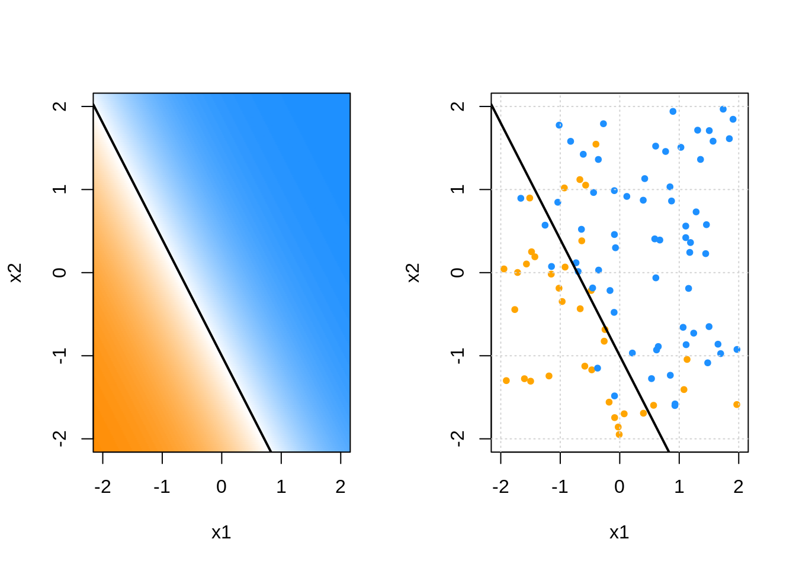

# Classification

Coming soon! By end of day on Monday! Check the videos for now!

<!-- ```{r setup, include = FALSE} -->
<!-- knitr::opts_chunk$set(echo = TRUE, fig.align = "center", cache = TRUE, autodep = TRUE) -->
<!-- ``` -->

<!-- This chapter continues our discussion of **supervised learning** by introducing the **classification** tasks. Linear regression, we will focus on the conditional distribution of the response. -->

<!-- Specifically, we will discuss: -->

<!-- - The **Bayes classifier** and **Bayes error**. -->
<!-- - Estimating **conditional probabilities**. -->
<!-- - Two simple **metrics** for the classification task. -->

<!-- ## R Setup and Source -->

<!-- ```{r packages, warning = FALSE, message = FALSE} -->
<!-- library(tibble)     # data frame printing -->
<!-- library(dplyr)      # data manipulation -->

<!-- library(knitr)      # creating tables -->
<!-- library(kableExtra) # styling tables -->
<!-- ``` -->

<!-- Additionally, objects from `ggplot2`, `GGally`, and `ISLR` are accessed. Recall that the [Welcome](index.html) chapter contains directions for installing all necessary packages for following along with the text. The R Markdown source is provided as some code, mostly for creating plots, has been suppressed from the rendered document that you are currently reading. -->

<!-- - **R Markdown Source:** [`linear-regression.Rmd`](linear-regression.Rmd) -->


<!----------------------------------------------------------------------------->


***

In this chapter we will introduce **classification**. The main difference between classification and regression is the type of variable used as the response. In regression, we used a numeric response. In classification, we use a **categorical** response.

This chapter is not all of classification. We will spend many additional chapters uncovering details of classification.

***

## Reading

We're going to try something odd this week No reading! (At least for now. This is sort of the opposite of last week.) Instead, watch the video posted to the course website. Our goal is to show you that almost everything you learned in regression immediately transfers to performing classification. This video simply defines a few new terms and tasks. It might prove frustrating at first, but hopefully you will quickly realize the pattern. (If not, we'll explain in greater detail over the next week chapters and weeks.)

***

## Classification Metrics

**Misclassification** Rate


```r
calc_misclass = function(actual, predicted) {
  mean(actual != predicted)
}
```

**Accuracy**


```r
calc_accuracy = function(actual, predicted) {
  mean(actual == predicted)
}
```

***

## Source

- `R` Markdown: [`classification.Rmd`](classification.Rmd)

***

***

## STAT 432 Materials

- [**Slides** | Classification: Introduction](https://fall-2019.stat432.org/slides/classification.pdf)
- [**Code** | Some Classification Code](https://fall-2019.stat432.org/misc/some-class-code-for-class.R)
- [**Slides** | Classification: Binary Classification](https://fall-2019.stat432.org/slides/binary-classification.pdf)
- [**Code** | Some Binary Classification Code](https://fall-2019.stat432.org/misc/some-binary-class-code-for-class.R)
- [**Slides** | Classification: Nonparametric Classification](https://fall-2019.stat432.org/slides/nonparametric-classification.pdf)
- [**Reading** | STAT 420: Logistic Regression](https://daviddalpiaz.github.io/appliedstats/logistic-regression.html)
- [**Slides** | Classification: Logistic Regression](https://fall-2019.stat432.org/slides/logistic-regression.pdf)

***


```r
library("dplyr")
library("knitr")
library("kableExtra")
library("tibble")
library("caret")
library("rpart")
library("nnet")
```

## Bayes Classifier

- TODO: Not the same as naïve Bayes classifier

$$
p_k(x) = P\left[ Y = k \mid X = x \right]
$$

$$
C^B(x) = \underset{k \in \{1, 2, \ldots K\}}{\text{argmax}} P\left[ Y = k \mid X = x \right]
$$

***

### Bayes Error Rate

$$
1 - \mathbb{E}_X\left[ \underset{k}{\text{max}} \ P[Y = k \mid X = x] \right]
$$


## Building a Classifier

$$
\hat{p}_k(x) = \hat{P}\left[ Y = k \mid X = x \right]
$$

$$
\hat{C}(x) = \underset{k \in \{1, 2, \ldots K\}}{\text{argmax}} \hat{p}_k(x)
$$

- TODO: first estimation conditional distribution, then classify to label with highest probability


```r
gen_data = function(n = 100) {
  x = sample(c(0, 1), prob = c(0.4, 0.6), size = n, replace = TRUE)
  y = ifelse(test = {x == 0},
             yes = sample(c("A", "B", "C"), size = n, prob = c(0.25, 0.50, 0.25), replace = TRUE),
             no = sample(c("A", "B", "C"), size = n, prob = c(0.1, 0.1, 0.4) / 0.6, replace = TRUE))

  tibble(x = x, y = factor(y))
}

test_cases = tibble(x = c(0, 1))

set.seed(42)
some_data = gen_data()

predict(knn3(y ~ x, data = some_data), test_cases)
```

```
##              A          B         C
## [1,] 0.2608696 0.39130435 0.3478261
## [2,] 0.1481481 0.07407407 0.7777778
```

```r
predict(rpart(y ~ x, data = some_data), test_cases)
```

```
##           A          B         C
## 1 0.2608696 0.39130435 0.3478261
## 2 0.1481481 0.07407407 0.7777778
```

```r
predict(multinom(y ~ x, data = some_data, trace = FALSE), test_cases, type = "prob")
```

```
##           A          B         C
## 1 0.2608699 0.39130496 0.3478251
## 2 0.1481478 0.07407414 0.7777781
```

## Modeling

### Linear Models

- TODO: use `nnet::multinom`
    - in place of `glm()`? always?

### k-Nearest Neighbors

- TODO: use `caret::knn3()`

### Decision Trees

- TODO: use `rpart::rpart()`


## Data Setup

## Mathematical Setup

## Example


```r
set.seed(1)
joint_probs = round(1:12 / sum(1:12), 2)
joint_probs = sample(joint_probs)
joint_dist = matrix(data  = joint_probs, nrow = 3, ncol = 4)
colnames(joint_dist) = c("$X = 1$", "$X = 2$", "$X = 3$", "$X = 4$")
rownames(joint_dist) = c("$Y = A$", "$Y = B$", "$Y = C$")
joint_dist %>% 
  kable() %>% 
  kable_styling("striped", full_width = FALSE) %>% 
  column_spec(column = 1, bold = TRUE, background = "white", border_right = TRUE)
```

<table class="table table-striped" style="width: auto !important; margin-left: auto; margin-right: auto;">
 <thead>
  <tr>
   <th style="text-align:left;">   </th>
   <th style="text-align:right;"> $X = 1$ </th>
   <th style="text-align:right;"> $X = 2$ </th>
   <th style="text-align:right;"> $X = 3$ </th>
   <th style="text-align:right;"> $X = 4$ </th>
  </tr>
 </thead>
<tbody>
  <tr>
   <td style="text-align:left;font-weight: bold;background-color: white !important;border-right:1px solid;"> $Y = A$ </td>
   <td style="text-align:right;"> 0.12 </td>
   <td style="text-align:right;"> 0.01 </td>
   <td style="text-align:right;"> 0.04 </td>
   <td style="text-align:right;"> 0.14 </td>
  </tr>
  <tr>
   <td style="text-align:left;font-weight: bold;background-color: white !important;border-right:1px solid;"> $Y = B$ </td>
   <td style="text-align:right;"> 0.05 </td>
   <td style="text-align:right;"> 0.03 </td>
   <td style="text-align:right;"> 0.10 </td>
   <td style="text-align:right;"> 0.15 </td>
  </tr>
  <tr>
   <td style="text-align:left;font-weight: bold;background-color: white !important;border-right:1px solid;"> $Y = C$ </td>
   <td style="text-align:right;"> 0.09 </td>
   <td style="text-align:right;"> 0.06 </td>
   <td style="text-align:right;"> 0.08 </td>
   <td style="text-align:right;"> 0.13 </td>
  </tr>
</tbody>
</table>


```r
# marginal distribution of Y
t(colSums(joint_dist)) %>% kable() %>% kable_styling(full_width = FALSE)
```

<table class="table" style="width: auto !important; margin-left: auto; margin-right: auto;">
 <thead>
  <tr>
   <th style="text-align:right;"> $X = 1$ </th>
   <th style="text-align:right;"> $X = 2$ </th>
   <th style="text-align:right;"> $X = 3$ </th>
   <th style="text-align:right;"> $X = 4$ </th>
  </tr>
 </thead>
<tbody>
  <tr>
   <td style="text-align:right;"> 0.26 </td>
   <td style="text-align:right;"> 0.1 </td>
   <td style="text-align:right;"> 0.22 </td>
   <td style="text-align:right;"> 0.42 </td>
  </tr>
</tbody>
</table>


```r
# marginal distribution of X
t(rowSums(joint_dist)) %>% kable() %>% kable_styling(full_width = FALSE)
```

<table class="table" style="width: auto !important; margin-left: auto; margin-right: auto;">
 <thead>
  <tr>
   <th style="text-align:right;"> $Y = A$ </th>
   <th style="text-align:right;"> $Y = B$ </th>
   <th style="text-align:right;"> $Y = C$ </th>
  </tr>
 </thead>
<tbody>
  <tr>
   <td style="text-align:right;"> 0.31 </td>
   <td style="text-align:right;"> 0.33 </td>
   <td style="text-align:right;"> 0.36 </td>
  </tr>
</tbody>
</table>


## MISC TODO STUFF

- TODO: https://topepo.github.io/caret/visualizations.html
- TODO: https://en.wikipedia.org/wiki/Confusion_matrix
- TODO: https://en.wikipedia.org/wiki/Matthews_correlation_coefficient
- TODO: https://people.inf.elte.hu/kiss/11dwhdm/roc.pdf
- TODO: https://www.cs.cmu.edu/~tom/mlbook/NBayesLogReg.pdf
- TODO: http://www.oranlooney.com/post/viz-tsne/
- TODO: https://web.expasy.org/pROC/
- TODO: https://bmcbioinformatics.biomedcentral.com/track/pdf/10.1186/1471-2105-12-77
- TODO: https://en.wikipedia.org/wiki/Receiver_operating_characteristic
- TODO: https://papers.nips.cc/paper/2020-on-discriminative-vs-generative-classifiers-a-comparison-of-logistic-regression-and-naive-bayes.pdf
- https://citeseerx.ist.psu.edu/viewdoc/download?doi=10.1.1.141.751&rep=rep1&type=pdf
- https://www.cs.ubc.ca/~murphyk/Teaching/CS340-Fall06/lectures/naiveBayes.pdf
- http://www.stat.cmu.edu/~ryantibs/statml/lectures/linearclassification.pdf
- https://www.cs.cmu.edu/~tom/mlbook/NBayesLogReg.pdf


```r
sim_2d_logistic = function(beta_0, beta_1, beta_2, n) {
  
  par(mfrow = c(1, 2))
  
  prob_plane = as_tibble(expand.grid(x1 = -220:220 / 100, 
                                     x2 = -220:220 / 100))
  prob_plane$p = with(prob_plane, 
                      boot::inv.logit(beta_0 + beta_1 * x1 + beta_2 * x2))
  
  do_to_db = colorRampPalette(c('darkorange', "white", 'dodgerblue'))
  
  plot(x2 ~ x1, data = prob_plane, 
       col = do_to_db(100)[as.numeric(cut(prob_plane$p, 
                                          seq(0, 1, length.out = 101)))],
       xlim = c(-2, 2), ylim = c(-2, 2), pch = 20)
  abline(-beta_0 / beta_2, -beta_1 / beta_2, col = "black", lwd = 2)
  
  x1 = runif(n = n, -2, 2)
  x2 = runif(n = n, -2, 2)
  y = rbinom(n = n, size = 1, prob = boot::inv.logit(beta_0 + beta_1 * x1 + beta_2 * x2))
  y = ifelse(y == 1, "dodgerblue", "orange")
  asdf = tibble(x1, x2, y)
  
  plot(x2 ~ x1, data = asdf, col = y, xlim = c(-2, 2), ylim = c(-2, 2), pch = 20)
  grid()
  abline(-beta_0 / beta_2, -beta_1 / beta_2, col = "black", lwd = 2)
  
}

sim_2d_logistic(beta_0 = 2 * 0.5, beta_1 = 2* 0.7, beta_2 = 2* 0.5, n = 100)
```


