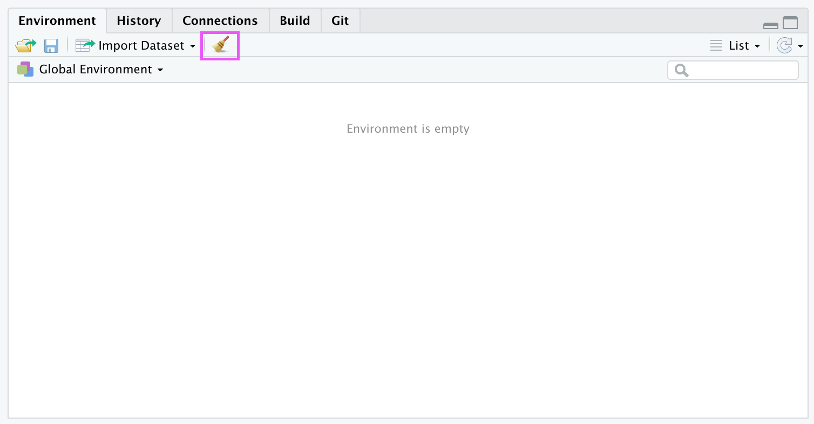
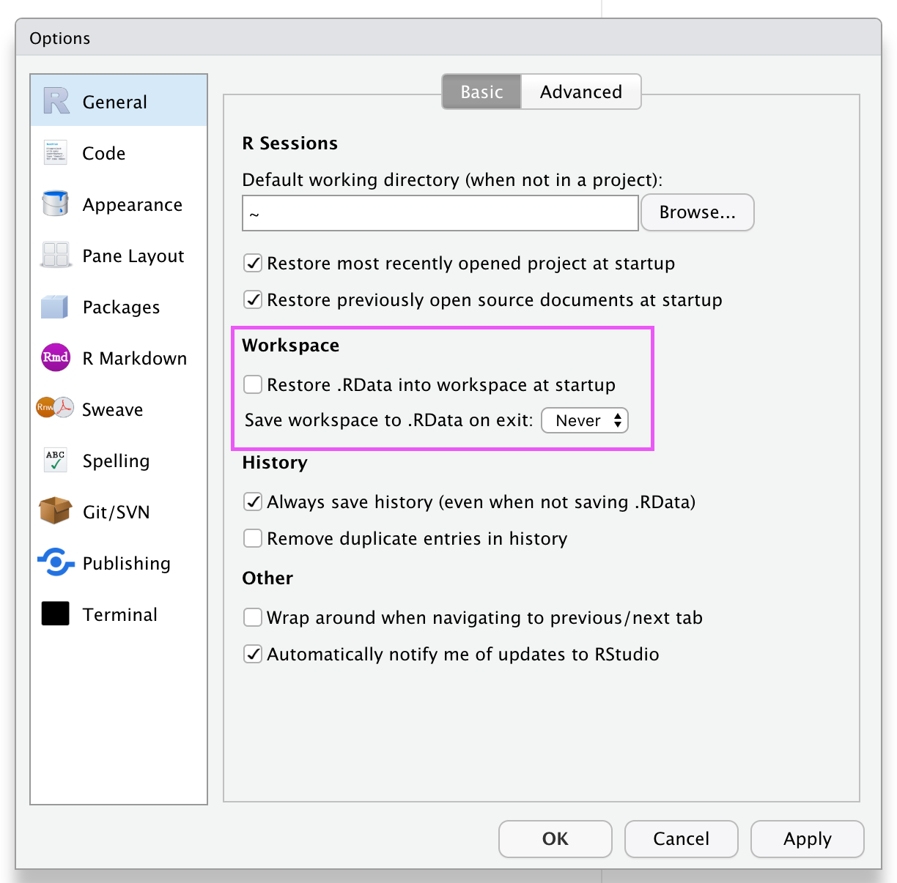

# Computing

```{r setup, include = FALSE}
knitr::opts_chunk$set(echo = TRUE, fig.align = "center", cache = TRUE, autodep = TRUE)
```

STAT 432 is **not** a course about R. It is however, a course that makes heavy use of R. Because of this, you will need to be familiar with R. This text will point out some things about R along the way, but some previous study of R is necessary.

## Reading

The following reading suggestions are long. While it may seem daunting to read all of this material, it will likely prove to be valuable. A smart strategy would be:

- "Read" as much of the information here, where "read" simply means read every single word and line of code, but don't slow down if you don't fully understand.
- Return to some selections from this reading **every week** spending more time understanding specific sections.

Whether you're a novice or an expert, there is a high probability that any effort towards reading these sources will provide a return. If you use the strategy above, over time you will start to see the bigger picture.

- **Required:** [Hands-On Programming with R](https://rstudio-education.github.io/hopr/) - *Garrett Grolemund*
  - If you have never used R or RStudio before, Part 1 (Chapters 1 - 3) will be useful. Even if you have used R before, you will likely gain something from reading these sections.
- **Recommended:** [R for Data Science](https://r4ds.had.co.nz/) - *Garrett Grolemund, Hadley Wickham*
  - This book helps getting you up to speed working with data in R. While it is a lot of reading, Chapters 1 - 21 may prove useful. It probably isn't worth sitting down and reading this from start to finish right now, but reading it here and there during some free time would be a good idea.
- **Recommended:** [Advanced R](https://adv-r.hadley.nz/) - *Hadley Wickham*
  - Part I (Chapters 1 - 8) of this book will help create a mental model for working with R. These chapters are not an easy read, so they should be returned to often. Chapter 2 could be safely skipped for our purposes, but is important if you will use R in the long term.
- **Reference:** [Applied Statistics with R](https://daviddalpiaz.github.io/appliedstats/) - *David Dalpiaz*
  - If you are a UIUC student who took the course STAT 420, the first six chapters of that book could serve as a nice refresher, however, the three readings above are preferred. Chapter 6 contain three very useful video playlists and an R Markdown template. Note that the videos were created a few years ago, thus there may be minor differences between then and now, but the general ideas are the same.
    - [Video Playlist: `R` and RStudio](https://www.youtube.com/playlist?list=PLBgxzZMu3GpMjYhX7jLm5B9gEV7AOOJ5w)
    - [Video Playlist: Data in `R`](https://www.youtube.com/playlist?list=PLBgxzZMu3GpPojVSoriMTWQCUno_3hjNi)
    - [Video Playlist: R Markdown](https://www.youtube.com/playlist?list=PLBgxzZMu3GpNgd07DwmS-2odHtMO6MWGH)
    - [Template: R Markdown](https://daviddalpiaz.github.io/appliedstats/tutorial/rmd-template.zip)

R Markdown will be used throughout the course, but you will not be required to use R Markdown until the final weeks when we begin working on data analyses. At that time, we will suggest some additional reading about R Markdown. When working on quizzes until then, you can use either an R script or an R Markdown document, whichever you are more comfortable with.

## Additional Resources

In addition to the above readings, the following resources are more specific or more advanced, but could still prove to be useful.

### R

- [Efficient R programming](https://csgillespie.github.io/efficientR/)
- [R Programming for Data Science](https://bookdown.org/rdpeng/rprogdatascience/)
- [R Graphics Cookbook](https://r-graphics.org/)
- [Modern Dive](https://moderndive.com/index.html)
- [What They Forgot to Teach You About R](https://rstats.wtf/)
- [The R Inferno](https://www.burns-stat.com/pages/Tutor/R_inferno.pdf)
- [Data Wrangling, Exploration, and Analysis with R](https://stat545.com/)
- [The `tidyverse` Website](tidyverse.org/)
  - [`dplyr` Website](https://dplyr.tidyverse.org/)
  - [`readr` Website](https://readr.tidyverse.org/)
  - [`tibble` Website](https://tibble.tidyverse.org/)
  - [`forcats` Website](https://forcats.tidyverse.org/)

### RStudio

- [RStudio IDE Cheatsheet](https://resources.rstudio.com/rstudio-cheatsheets/rstudio-ide-cheat-sheet)
- [RStudio Resources](https://resources.rstudio.com/)

### R Markdown

- [R Markdown Cheatsheet](https://resources.rstudio.com/rstudio-cheatsheets/rmarkdown-2-0-cheat-sheet)
- [R Markdown: The Definitive Guide](https://bookdown.org/yihui/rmarkdown/) - *Yihui Xie, J. J. Allaire, Garrett Grolemund*
- [R Markdown Cookbook](https://bookdown.org/yihui/rmarkdown-cookbook/)
- [R4DS: R Markdown Chapter](https://r4ds.had.co.nz/r-markdown.html)

#### Markdown

- [Daring Fireball - Markdown: Basics](https://daringfireball.net/projects/markdown/basics)
- [GitHub - Mastering Markdown](https://guides.github.com/features/mastering-markdown/)
- [CommonMark](https://commonmark.org/)

## STAT 432 Idioms

R tutorials and advice are plentiful online. While we do not want to discourage you from using the resources above, or using your own creativity, the following sections will specify some strong suggestions for how to use R, RStudio, and R Markdown in STAT 432.

In other words, information below here supersedes any information from the above sources.

### Don't Restore Old Workspaces

Due to some odd default settings in RStudio, some students **never** clear their R environment. This is a problem for a number of reasons. (It could prevent your results from being reproducible.) To get ready for STAT 432, do the following:

1. Clear your current environment.



2. Change some RStudio defaults.
- Deselect "Restore .RData into workspace at startup.
- Set "Save workspace .RData on exit:" to "Never"



This will save you a lot of headache in STAT 432 and the future.

### R Versions

You should always use the most up-to-date version of R and RStudio. You **must** use at least R version 4.0.2.

Importantly, R versions after 3.6.0 have slightly different random number generation. Although, even with the most recent version, sometimes R keeps the old random number generation. To check that you are on the most recent random number generation, run:

```{r}
RNGkind()
```

If your output matches the output above, you're all set. If not, run:

```{r, eval = FALSE}
RNGversion(getRversion())
```

Then re-run `RNGkind()` and everything should match up and you should be good to go!

### Packages

Be sure to keep your packages up-to-date. To do so:

- Restart RStudio
- Click the "Packages" tab
- Click "Update"
- Click "Select All"
- Click "Install Updates"

At this point, you may be asked: "Do you want to restart R prior to installing?" Select "Yes." If asked again, Select "No."

During the update you may be asked "Do you want to install from sources the packages which need compilation? (Yes/no/cancel)" Type `no` and press enter. (Do the same if you encounter this when installing packages.)

Errors often rise when installing packages. Two common tips to overcome these:

- Simply retry the installation.
- If you see the name of another package in an error message, try installing that package, then retry installing the original package.

### Code Style

Code needs to be read by two distinct groups:

- Computers
- **Humans**

Computers will complain, very loudly, when you write "bad" code, that is code that does not run. We need to write code that is syntactically correct for the computer to be able to "read" our code. Computers **only** care about syntax. If we relate this to natural language, we would say that computers really only care about grammar and punctuation. They don't worry about style like phrasing, tone, etc.

While computers will complain about bad code, does anyone really care about wasting their time? (OK, sure, computer scientists might.) If we give them bad code, they try to run it, fail, then complain. However, they're soulless machines, they can handle it.

Humans on the other hand have a finite amount of time on this earth. Even if we solve aging, we still have to deal with the [heat death of the universe](https://en.m.wikipedia.org/wiki/Heat_death_of_the_universe). Thus, while wasting a computer's time is no big deal, wasting a human's time is, frankly, immoral. What does this have to do with R programming? Humans are going to read your R code. One of those humans is likely to be you, but future you. To make this reading possible and efficient, you need to develop **style**.

Here is some code that a computer can read, but a human will struggle to read:

```{r, eval = FALSE}
set.seed(1337);mu=10;sample_size=50;samples=100000;x_bars=rep(0, samples);
for(i in 1:samples){x_bars[i]=mean(rpois(sample_size,lambda = mu))}
x_bar_hist=hist(x_bars,breaks=50,main="Histogram of Sample Means",
xlab="Sample Means",col="darkorange",border = "dodgerblue")
```

Now, written again, but readable by a human:

```{r, eval = FALSE}
# set seed for reproducibility
set.seed(1337)

# setup simulation parameters
mu = 10
sample_size = 50
samples = 100000

# create vector to store simulation results
x_bars = rep(0, samples)

# run simulation
for (i in 1:samples) {
  x_bars[i] = mean(rpois(sample_size, lambda = mu))
}

# plot results
x_bar_hist = hist(
  x_bars,
  breaks = 50,
  main = "Histogram of Sample Means",
  xlab = "Sample Means",
  col = "darkorange",
  border = "dodgerblue"
)
```

To the computer, these are the same. To a human, one makes you want to pull your hair out, the other you can glance at and have a pretty good idea about what is going on.

Style is subjective, but we'll define some guiding principles, and a few rules.

### Reference Style

So as to not have to define a style from the ground up, we will use the `tidyverse` style as our initial reference.

- [`tidyverse` Style Guide](https://style.tidyverse.org/)

We will agree with the vast majority of the guidelines here. The exceptions are listed in the next section.

### STAT 432 R Style Overrides

- All commas must be followed by a space. (Additionally, commas should never be preceded by a space.)
- [Infix operators (`==`, `+`, `-`, `<-`, etc.) should always be surrounded by spaces.](https://style.tidyverse.org/syntax.html#infix-operators)
    - Exceptions: `:`, `::`, `$`, `[`, `[[`, `]`, `]]`
    - `^`: Use `x ^ 2` instead of  `x^2`.
- You may use `=` instead of `<-`.
  - This is very much a [minority position](https://thecoatlessprofessor.com/programming/r/an-opinionated-tale-of-why-you-should-replace-with/) in the R community. But we see [more examples](http://www.win-vector.com/blog/2013/04/prefer-for-assignment-in-r/) of it being promoted every day. My reasoning for this is complicated (and I should write more about it soon) but not super important. Instead, what is important: **Do not mix assignment operators.** Either use `=` or use `<-` but do not mix and match in the same script.
- Never use `T` or `F`, only `TRUE` or `FALSE`. While this should never happen, take a look at this terrifying example.
```{r}
FALSE == TRUE # checking for equality
F == TRUE # checking for equality
F =  TRUE # A VERY BAD ASSIGNMENT! DO NOT DO THIS!
F == TRUE # checking for equality, with a wild result!
# TRUE = FALSE # This won't run, which is good!
```
- Do not use `;`. This is mostly a readability issue.
- Do not use `attach()`. Without going into the details, you will save yourself a lot of headache someday if you follow this advice.
- Do not use `<<-`. You probably didn't know this exists. Pretend that is still the case.
- Do not set a working directory by using `setwd()` or any other method. This will make your scripts and R Markdown documents much more reproducible.
- Do not use absolute paths.
- Place a space after any `#` used to create a comment.
- No more than one newline (blank line) in a row
- Do not put spaces in filenames. Use dashes `-` or underscores `_`. Also consider only using lowercase.
- Load all packages before setting a seed.
- Opening (left) curly braces should not be on their own line.
- Except for the first argument to a function, argument names should be written in function calls. (Exception for the `predict()` function. **Do not name the second argument to the `predict()` function. If you do, you will regret it eventually!**)
- Place a newline at the end of the file.

### STAT 432 R Markdown Style

Some of the previous section applies here as well, but additionally, some more specific R Markdown style guidelines:

- No more than one newline (blank line) in a row in an R Markdown document.
- No more than one newline (blank line) in a row in an R chunk.
- A newline before and after each chunk in an R Markdown document.
- No newline to start a chunk. No newline at end of chunk. (The first and last line of each chunk should contain code, or a comment for the first line.)
- Use headers appropriately! (Short names, good structure.)
- Load all needed packages at the beginning of an analysis in a single chunk.
- One plot per chunk! Plotting chunks should return one plot and nothing else. (No numeric printing.)

### Style Heuristics

Now that we've overwhelmed you with information about style, we will leave you with the real advice. The most important thing to consider when evaluating the style of your code is **consistency**.

In order, you should be consistent:

- with yourself!
- with your group!
- with your organization!

Blindly following the rules is foolish. Breaking rules can be fun! If you do it in a way that makes life easier for everyone, by all mean, do it.

### Objects and Functions

> To understand computations in R, two slogans are helpful:
> 
> - Everything that exists is an object. 
> - Everything that happens is a function call. 
>
> — John Chambers

As you continue to sharpen your `R` skills, keep this quotation in mind. Eventually, you will realize that everything you "do" in R, you do by running a function. To debug your code, you will need to explore the objects returned by functions. To fix your code, you will need to alter the inputs to functions, which are objects.

In STAT 432, the objects that we will encounter will almost always be:

- vectors
- lists
- data frames
- model objects (Mostly lists with a class of the model type.)

If you become proficient at creating, manipulating, and accessing these objects, you will likely have success in STAT 432.

### Print versus Return

One of the more confusing aspects of R is the difference between what is returned when running a function, and what is printed when running a function (interactively) as a user.

Consider fitting the following linear model.

```{r}
cars_mod = lm(dist ~ speed, data = cars)
```

You might think that you can simply type `cars_mod` to see what was returned by `lm()`.

```{r}
cars_mod
```

However, this is **not** what was *returned*. This is what was *printed*. To better understand what was returned, we use the `str() function.

```{r}
str(cars_mod)
```

This is a huge mess, but most importantly, at the top we are told that `cars_mod` is a **list**. (It's technically a object of class `"lm"`, but it functions like a list.)

```{r}
class(cars_mod)
```

```{r}
is.list(cars_mod)
```

Thus to access certain information returned by `lm()` we need to access `cars_mod` as a list.

```{r}
cars_mod$coefficients
```

Note that what is returned here is a vector, so we could pull out a particular value using vector syntax.

```{r}
cars_mod$coefficients["speed"]
```

Since `lm()` truly returns an object of type `"lm"` we can pass `cars_mods` to some generic functions, and then specific versions for objects of type `"lm"` will be used.

```{r}
coef(cars_mod)
```

```{r}
predict(cars_mod, data.frame(speed = 5:10))
```

```{r}
summary(cars_mod)
```

Hey, wait, what is returned by `summary()`?

```{r}
class(summary(cars_mod))
```

```{r}
is.list(summary(cars_mod))
```

The `summary()` function returns an object of type `"summary.lm"` which functions as a list!

```{r}
summary(cars_mod)$fstatistic
```

You can also use the `View()` function, which is specific to RStudio, to view the structure of any object.

```{r, eval = FALSE}
View(summary(cars_mod)) # RStudio only
```

### Help

To get documentation about a function in R, simply put a question mark in front of the function name and RStudio will display the documentation, for example:

```{r}
?log
?sin
?paste
?lm
```

Frequently one of the most difficult things to do when learning R is asking for help. First, you need to decide to ask for help, then you need to know how to ask for help. Your very first line of defense should be to Google your error message or a short description of your issue. (The ability to solve problems using this method is quickly becoming an extremely valuable skill.) If that fails, and it eventually will, you should ask for help. There are a number of things you should include when emailing an instructor, or posting to a help website such as Stack Exchange.

- Describe what you **expect** the code to do.
- State the end goal you are trying to achieve. (Sometimes what you expect the code to do, is not what you want to actually do.)
- Provide the full text of any errors you have received.
- Provide enough code to **recreate** the error.
  - That is, create a [minimal reproducible example](https://yihui.org/en/2017/09/the-minimal-reprex-paradox/).

If you follow these steps, you will get your issue resolved much quicker, and possibly learn more in the process. Do not be discouraged by running into errors and difficulties when learning R. (Or any technical skill.) It is simply part of the learning process.

While taking STAT 432: Come to office hours!

### Keyboard Shortcuts

This section should be expanded over time, but for now, two strong suggestions:

- Get in the habit of using the keyboard as much as possible, and the mouse as little as possible.
  - A keyboard is a precise entry tool, a mouse is not.
  - Using a mouse requires you to move your hands, a keyboard does not.
- Hit the `[TAB]` key often. Like, all the time.
  - It will autocomplete function and object names.
  - It will autofill argument names. (This removes the need to memorize arguments!)
