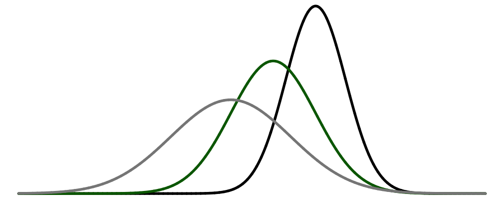

--- 
title: "Basics of Statistical Learning"
author: "[David Dalpiaz](https://daviddalpiaz.com/)"
date: "2020-02-16"
github-repo: daviddalpiaz/bsl
url: 'https\://statisticallearning.org/'
knit: "bookdown::render_book"
site: bookdown::bookdown_site
documentclass: book
---

***

# Start Here {-}

***

Welcome to Basics of Statistical Learning! What a boring title! The title was chosen to mirror the [University of Illinois](https://illinois.edu/) course [STAT 432 - Basics of Statistical Learning](www.stat432.org). That title was chosen to meet certain University course naming conventions, hence the boring title. A more appropriate title would be "Machine Learning from the Perspective of a Statistician who uses R," which is more descriptive, but still a boring title. Anyway, this "book" will often be referred to as **BSL**.

***

## Caveat Emptor {-}

**This "book" is under active development.** Literally every element of the book is subject to change, at any moment. This text, BSL, is the successor to [R4SL](https://daviddalpiaz.github.io/r4sl/), an unfinished work that began as a supplement to [Introduction to Statistical Learning](https://faculty.marshall.usc.edu/gareth-james/ISL/), but was never finished. (In some sense, this book is just a fresh start due to the author wanting to change the presentation of the material. The author is seriously worried that he will encounter the [second-system effect.](https://en.wikipedia.org/wiki/Second-system_effect))

Because this book is written with a course in mind, that is actively being taught, often out of convenience the text will speak directly to the students of that course. Thus, be aware that any reference to a "course" are a reference to [STAT 432 @ UIUC](www.stat432.org).

<!-- A [**PDF** version](bsl.pdf) is maintained for use offline, however, given the pace of development, this should only be used if absolutely necessary. During development formatting in the PDF version will largely be ignored. -->

Since this book is under active development you may encounter errors ranging from typos, to broken code, to poorly explained topics. If you do, please let us know! [Better yet, fix the issue yourself!](https://yihui.name/en/2013/06/fix-typo-in-documentation/) If you are familiar with R Markdown and GitHub, [pull requests are highly encouraged!](https://github.com/daviddalpiaz/bsl). This process is partially automated by the edit button in the top-left corner of the html version. If your suggestion or fix becomes part of the book, you will be added to the list at the end of this chapter. We’ll also link to your GitHub account, or personal website upon request. If you're not familiar with version control systems feel free to email the author, `dalpiaz2 AT illinois DOT edu`. (But also consider using this opportunity to learn a bit about version control!) See additional details in the Acknowledgements section below.

While development is taking place, you may see "TODO" scattered throughout the text. These are mostly notes for internal use, but give the reader some idea of what development is still to come. For additional details on the development process, please see the [README](https://github.com/daviddalpiaz/bsl/blob/master/README.md) file on GitHub as well as the [Issues](https://github.com/daviddalpiaz/bsl/issues) page.

***

## Who? {-}

This book is targeted at advanced undergraduate or first year MS students in Statistics who have no prior machine learning experience. While both will be discussed in great detail, previous experience with both statistical modeling and R are assumed.

In other words, this books is for students in STAT 432.

***

## Acknowledgements {-}

The following is a (likely incomplete) list of helpful contributors. This book was also influenced by the helpful [contributors to R4SL](https://daviddalpiaz.github.io/r4sl/index.html#acknowledgements).

- [Jae-Ho Lee](https://www.linkedin.com/in/jae-ho-lee-32052710b/) - STAT 432, Fall 2019
- [W. Jonas Reger](https://www.linkedin.com/in/wjonasreger/) - STAT 432, Spring 2020

Your name could be here! Please see the [CONTRIBUTING](https://github.com/daviddalpiaz/bsl/blob/master/CONTRIBUTING.md) document on GitHub for details on interacting with this project. Pull requests encouraged!

Looking for ways to contribute?

- You'll notice that a lot of the plotting code is not displayed in the text, but is available in the source. Currently that code was written to accomplish a task, but without much thought about the best way to accomplish the task. Try refactoring some of this code.
- Fix typos. Since the book is actively being developed, typos are getting added all the time.
- Suggest edits. Good feedback can be just as helpful as actually contributing code changes.

<!-- TODO: Standing on the shoulder of giants. High level acknowledgements. -->

***

## License {-}

 

This work is licensed under a [Creative Commons Attribution-NonCommercial-ShareAlike 4.0 International License](http://creativecommons.org/licenses/by-nc-sa/4.0/)

***
