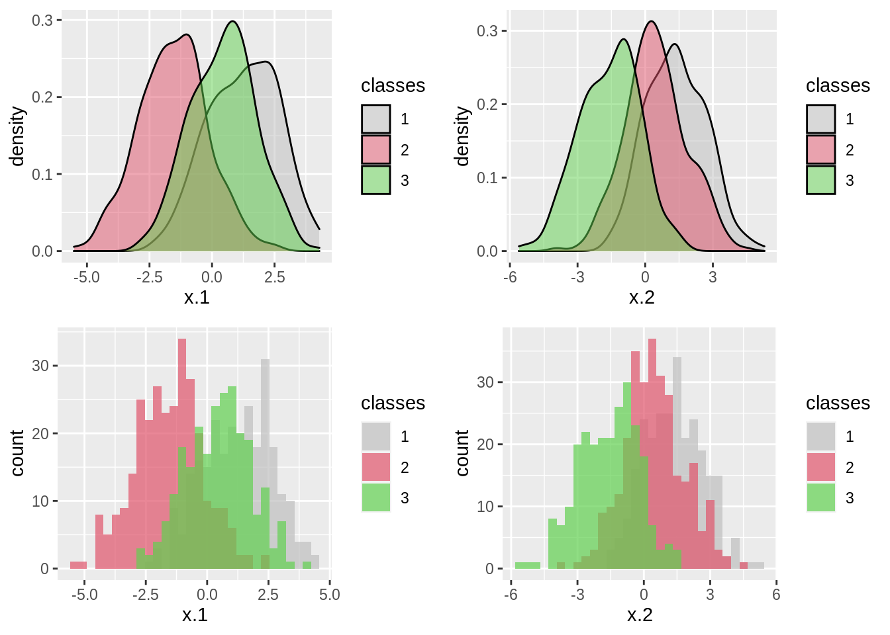
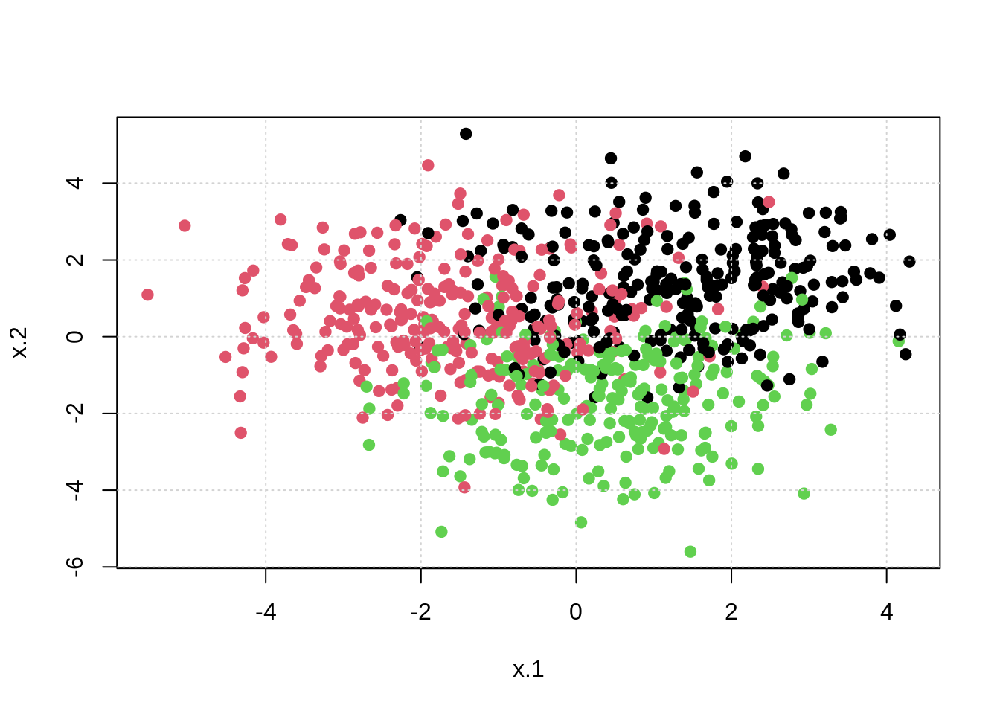
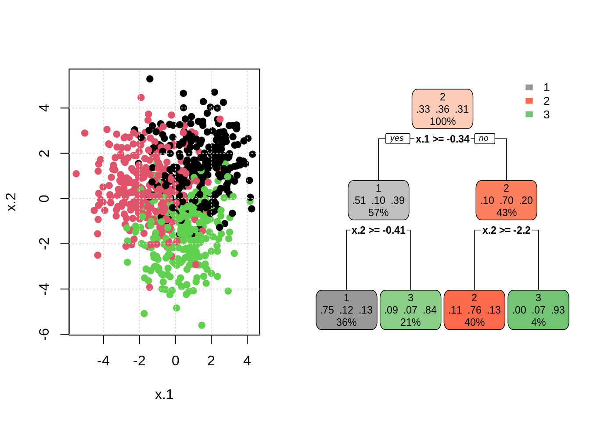
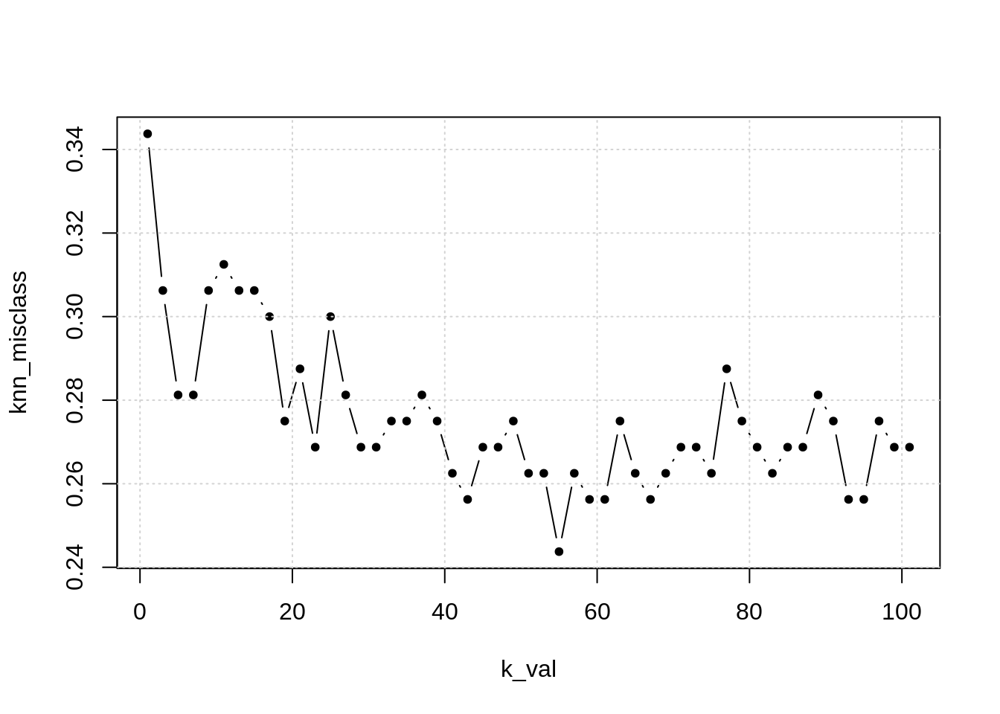
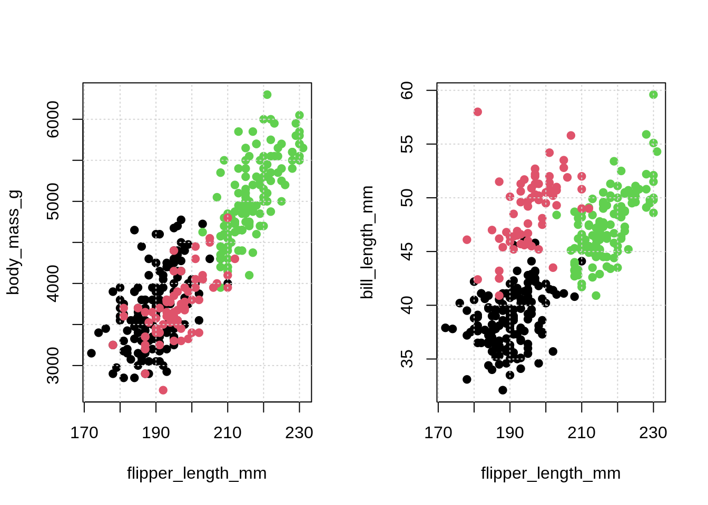
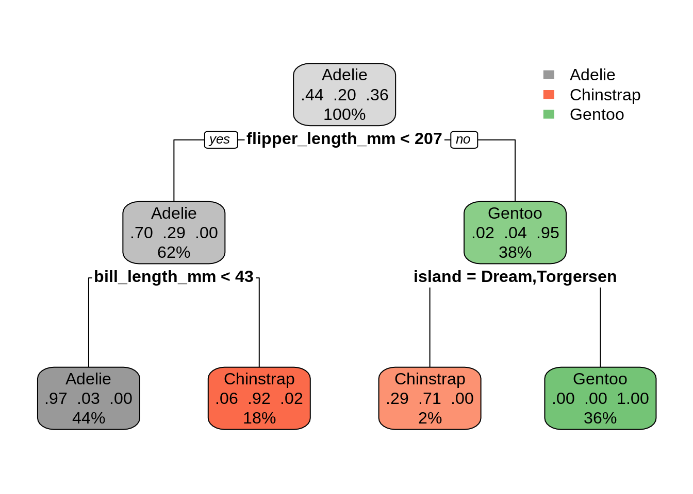
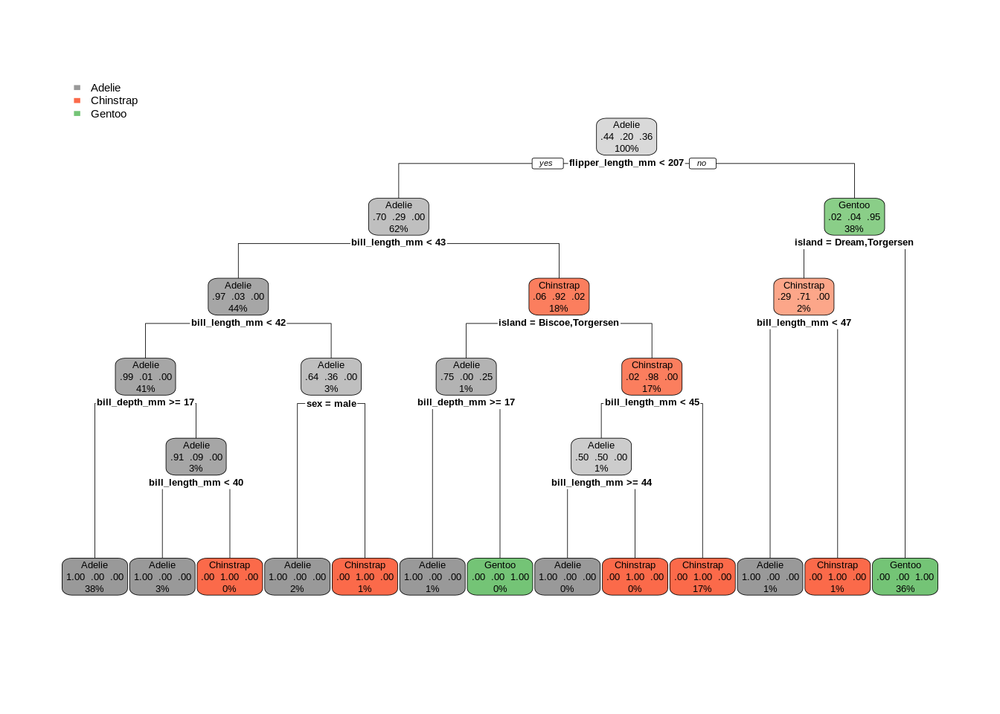

# Nonparametric Classification

Full book chapter still delayed! Keeping up with writing every week is getting tough. Below are the notes and code from the video.

- [**Notes:** Nonparametric Classification](files/nonparametric-classification.pdf)


```r
# load packages
library(tibble)
library(ggplot2)
library(rpart)
library(rpart.plot)
library(caret)
```

```
## Loading required package: lattice
```

```r
library(palmerpenguins)
library(mlbench)
```


```r
# set seed
set.seed(42)

# generate data
sim_data = as_tibble(mlbench.2dnormals(n = 1000, cl = 3, sd = 1.3))

# tst-trn split data
trn_idx = sample(nrow(sim_data), size = 0.8 * nrow(sim_data))
trn = sim_data[trn_idx, ]
tst = sim_data[-trn_idx, ]

# est-val split data
est_idx = sample(nrow(trn), size = 0.8 * nrow(trn))
est = trn[est_idx, ]
val = trn[-est_idx, ]

# check data
trn
```

```
## # A tibble: 800 x 3
##       x.1    x.2 classes
##     <dbl>  <dbl> <fct>  
##  1 -0.929  2.32  1      
##  2 -3.25   2.27  2      
##  3 -0.767  1.06  2      
##  4  3.42   3.10  1      
##  5  2.37   0.786 3      
##  6  3.90   1.54  1      
##  7 -0.373 -1.89  2      
##  8 -1.10  -1.58  2      
##  9  0.609  1.29  1      
## 10  2.31   1.49  1      
## # … with 790 more rows
```


```r
# visualize data

p1 = ggplot(data = trn, aes(x = x.1)) +
  geom_density(aes(fill = classes), alpha = 0.5) +
  scale_fill_manual(values=c("grey", 2, 3))

p2 = ggplot(data = trn, aes(x = x.2)) +
  geom_density(aes(fill = classes), alpha = 0.5) +
  scale_fill_manual(values=c("grey", 2, 3))

p3 = ggplot(data = trn, aes(x = x.1)) +
  geom_histogram(aes(fill = classes), alpha = 0.7, position = "identity") +
  scale_fill_manual(values=c("grey", 2, 3))

p4 = ggplot(data = trn, aes(x = x.2)) +
  geom_histogram(aes(fill = classes), alpha = 0.7, position = "identity") +
  scale_fill_manual(values=c("grey", 2, 3))

gridExtra::grid.arrange(p1, p2, p3, p4)
```

```
## `stat_bin()` using `bins = 30`. Pick better value with `binwidth`.
## `stat_bin()` using `bins = 30`. Pick better value with `binwidth`.
```




```r
plot(x.2 ~ x.1, data = trn, col = classes, pch = 20, cex = 1.5)
grid()
```




```r
# fit knn model
mod_knn = knn3(classes ~ ., data = trn, k = 10)

# make "predictions" with knn model
new_obs = data.frame(x.1 = 2, x.2 = -2)
predict(mod_knn, new_obs, type = "prob")
```

```
##      1 2 3
## [1,] 0 0 1
```

```r
predict(mod_knn, new_obs, type = "class")
```

```
## [1] 3
## Levels: 1 2 3
```


```r
# fit tree model
mod_tree = rpart(classes ~ ., data = trn, minsplit = 5)

# make "predictions" with knn model
new_obs = data.frame(x.1 = 3, x.2 = 3)
predict(mod_tree, new_obs, type = "prob")
```

```
##           1        2         3
## 1 0.7508772 0.122807 0.1263158
```

```r
predict(mod_tree, new_obs, type = "class")
```

```
## 1 
## 1 
## Levels: 1 2 3
```


```r
# visualize tree results
par(mfrow = c(1, 2))
plot(x.2 ~ x.1, data = trn, col = classes, pch = 20, cex = 1.5)
grid()
rpart.plot(mod_tree, type = 2, box.palette = list("Grays", "Reds", "Greens"))
```




```r
# helper function to calculate misclassification
calc_misclass = function(actual, predicted) {
  mean(actual != predicted)
}

# calculate test metric
mod_knn = knn3(classes ~ ., data = trn, k = 10)
calc_misclass(
  actual = tst$classes,
  predicted = predict(mod_knn, tst, type = "class")
)
```

```
## [1] 0.215
```

```r
mean(tst$classes != predict(mod_knn, tst, type = "class"))
```

```
## [1] 0.225
```


## Example: KNN on Simulated Data


```r
# tune knn model ###############################################################

# set seed
set.seed(42)

# k values to consider
k_val = seq(1, 101, by = 2)

# function to fit knn to est for various k
fit_knn_to_est = function(k) {
  knn3(classes ~ ., data = est, k = k)
}

# fit models
knn_mods = lapply(k_val, fit_knn_to_est)

# make predictions
knn_preds = lapply(knn_mods, predict, val, type = "class")

# calculate validation misclass
knn_misclass = sapply(knn_preds, calc_misclass, actual = val$classes)

# plot results
plot(k_val, knn_misclass, pch = 20, type = "b")
grid()
```



```r
k_val[which.min(knn_misclass)]
```

```
## [1] 55
```

- TODO: add training misclass
- TODO: expand possible k value
- TODO: re-fit to training data, report test misclass

## Example: Decision Tree on Penguin Data


```r
# trees and penguins ###########################################################
```


```r
# check data
penguins
```

```
## # A tibble: 344 x 8
##    species island    bill_length_mm bill_depth_mm flipper_length_mm body_mass_g
##    <fct>   <fct>              <dbl>         <dbl>             <int>       <int>
##  1 Adelie  Torgersen           39.1          18.7               181        3750
##  2 Adelie  Torgersen           39.5          17.4               186        3800
##  3 Adelie  Torgersen           40.3          18                 195        3250
##  4 Adelie  Torgersen           NA            NA                  NA          NA
##  5 Adelie  Torgersen           36.7          19.3               193        3450
##  6 Adelie  Torgersen           39.3          20.6               190        3650
##  7 Adelie  Torgersen           38.9          17.8               181        3625
##  8 Adelie  Torgersen           39.2          19.6               195        4675
##  9 Adelie  Torgersen           34.1          18.1               193        3475
## 10 Adelie  Torgersen           42            20.2               190        4250
## # … with 334 more rows, and 2 more variables: sex <fct>, year <int>
```


```r
# visualize data
par(mfrow = c(1, 2))
plot(body_mass_g ~ flipper_length_mm, data = penguins,
     col = species, pch = 20, cex = 1.5)
grid()
plot(bill_length_mm ~ flipper_length_mm, data = penguins,
     col = species, pch = 20, cex = 1.5)
grid()
```




```r
# fit tree and visualize
peng_mod = rpart(species ~ . - year, data = penguins)
rpart.plot(peng_mod, type = 2, box.palette = list("Grays", "Reds", "Greens"))
```




```r
# fit bigger tree and visualize
peng_mod_big = rpart(species ~ . - year, data = penguins, minsplit = 2, cp = 0)
rpart.plot(peng_mod_big, type = 2, box.palette = list("Grays", "Reds", "Greens"))
```



- TODO: tune


<!-- ####################################################################### -->

<!-- ```{r setup, include = FALSE} -->
<!-- knitr::opts_chunk$set(echo = TRUE, fig.align = "center", cache = TRUE, autodep = TRUE) -->
<!-- ``` -->

<!-- ```{r} -->
<!-- library(tibble)     # data frame printing -->
<!-- library(dplyr)      # data manipulation -->

<!-- library(knitr)      # creating tables -->
<!-- library(kableExtra) # styling tables -->


<!-- library(rpart) -->
<!-- library(caret) -->

<!-- library(palmerpenguins) -->

<!-- library(ggplot2) -->

<!-- ``` -->


<!-- ```{r} -->
<!-- penguins = na.omit(palmerpenguins::penguins) -->
<!-- ``` -->


<!-- ```{r} -->
<!-- penguins -->
<!-- ``` -->

<!-- ```{r} -->
<!-- mass_flipper <- ggplot(data = penguins, -->
<!--                        aes(x = flipper_length_mm, -->
<!--                            y = body_mass_g)) + -->
<!--   geom_point(aes(color = species, -->
<!--                  shape = species), -->
<!--              size = 3, -->
<!--              alpha = 0.8) + -->
<!--   theme_minimal() + -->
<!--   scale_color_manual(values = c("darkorange","purple","cyan4")) + -->
<!--   labs(title = "Penguin size, Palmer Station LTER", -->
<!--        subtitle = "Flipper length and body mass for Adelie, Chinstrap and Gentoo Penguins", -->
<!--        x = "Flipper length (mm)", -->
<!--        y = "Body mass (g)", -->
<!--        color = "Penguin species", -->
<!--        shape = "Penguin species") + -->
<!--   theme(legend.position = c(0.2, 0.7), -->
<!--         legend.background = element_rect(fill = "white", color = NA), -->
<!--         plot.title.position = "plot", -->
<!--         plot.caption = element_text(hjust = 0, face= "italic"), -->
<!--         plot.caption.position = "plot") -->

<!-- mass_flipper -->

<!-- ``` -->

<!-- https://allisonhorst.github.io/palmerpenguins/articles/examples.html -->


<!-- ```{r} -->
<!-- predict(rpart(species ~ flipper_length_mm + body_mass_g, data = penguins), penguins, type = "prob") -->
<!-- ``` -->

<!-- ```{r} -->
<!-- GGally::ggpairs(penguins, mapping = aes(color = species),  -->
<!--         columns = names(penguins)[-1]) -->

<!-- ``` -->
