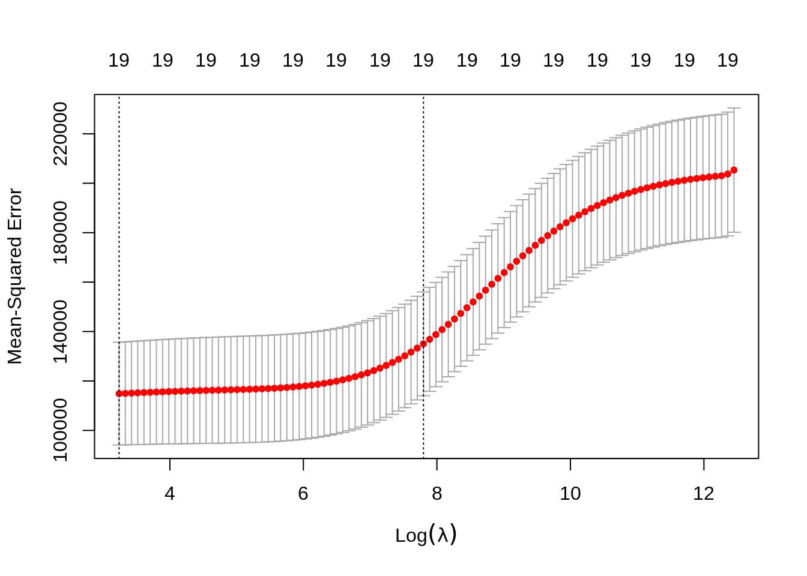
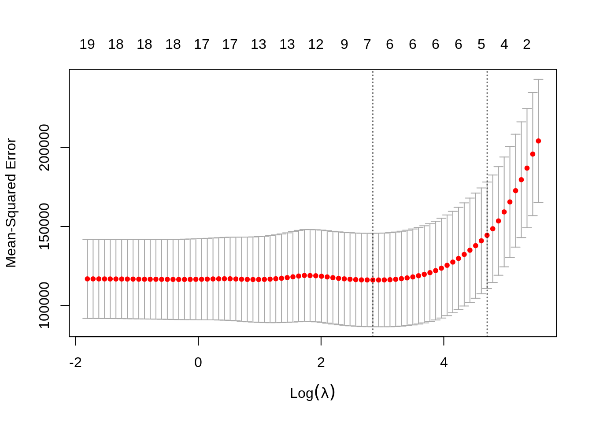

# Regularization


***

**Chapter Status:** Currently this chapter is very sparse. It essentially only expands upon an example discussed in ISL, thus only illustrates usage of the methods. Mathematical and conceptual details of the methods will be added later.

- [**Notes:** Cross-Validation](files/regularization.pdf)

We will use the `Hitters` dataset from the `ISLR` package to explore two shrinkage methods: **ridge regression** and **lasso**. These are otherwise known as **penalized regression** methods.


```r
data(Hitters, package = "ISLR")
```

This dataset has some missing data in the response `Salaray`. We use the `na.omit()` function to clean the dataset for ease-of-use.


```r
sum(is.na(Hitters))
```

```
## [1] 59
```

```r
sum(is.na(Hitters$Salary))
```

```
## [1] 59
```

```r
Hitters = na.omit(Hitters)
sum(is.na(Hitters))
```

```
## [1] 0
```

The feature variables are offensive and defensive statistics for a number of baseball players.


```r
names(Hitters)
```

```
##  [1] "AtBat"     "Hits"      "HmRun"     "Runs"      "RBI"       "Walks"    
##  [7] "Years"     "CAtBat"    "CHits"     "CHmRun"    "CRuns"     "CRBI"     
## [13] "CWalks"    "League"    "Division"  "PutOuts"   "Assists"   "Errors"   
## [19] "Salary"    "NewLeague"
```

We use the `glmnet()` and `cv.glmnet()` functions from the `glmnet` package to fit penalized regressions.


```r
library(glmnet)
```

Unfortunately, the `glmnet` function does not allow the use of model formulas, so we setup the data for ease of use with `glmnet`. Eventually we will use `train()` from `caret` which does allow for fitting penalized regression with the formula syntax, but to explore some of the details, we first work with the functions from `glmnet` directly.


```r
X = model.matrix(Salary ~ ., Hitters)[, -1]
y = Hitters$Salary
```

Note, we're being lazy and just using the full dataset as the training dataset.

First, we fit an ordinary linear regression, and note the size of the features' coefficients, and features' coefficients squared. (The two penalties we will use.)


```r
fit = lm(Salary ~ ., Hitters)
coef(fit)
```

```
##  (Intercept)        AtBat         Hits        HmRun         Runs          RBI 
##  163.1035878   -1.9798729    7.5007675    4.3308829   -2.3762100   -1.0449620 
##        Walks        Years       CAtBat        CHits       CHmRun        CRuns 
##    6.2312863   -3.4890543   -0.1713405    0.1339910   -0.1728611    1.4543049 
##         CRBI       CWalks      LeagueN    DivisionW      PutOuts      Assists 
##    0.8077088   -0.8115709   62.5994230 -116.8492456    0.2818925    0.3710692 
##       Errors   NewLeagueN 
##   -3.3607605  -24.7623251
```

```r
sum(abs(coef(fit)[-1]))
```

```
## [1] 238.7295
```

```r
sum(coef(fit)[-1] ^ 2)
```

```
## [1] 18337.3
```

## Ridge Regression

We first illustrate **ridge regression**, which can be fit using `glmnet()` with `alpha = 0` and seeks to minimize

$$
\sum_{i=1}^{n} \left( y_i - \beta_0 - \sum_{j=1}^{p} \beta_j x_{ij}    \right) ^ 2 + \lambda \sum_{j=1}^{p} \beta_j^2 .
$$

Notice that the intercept is **not** penalized. Also, note that that ridge regression is **not** scale invariant like the usual unpenalized regression. Thankfully, `glmnet()` takes care of this internally. It automatically standardizes predictors for fitting, then reports fitted coefficient using the original scale.

The two plots illustrate how much the coefficients are penalized for different values of $\lambda$. Notice none of the coefficients are forced to be zero.


```r
par(mfrow = c(1, 2))
fit_ridge = glmnet(X, y, alpha = 0)
plot(fit_ridge)
plot(fit_ridge, xvar = "lambda", label = TRUE)
```


We use cross-validation to select a good $\lambda$ value. The `cv.glmnet()`function uses 10 folds by default. The plot illustrates the MSE for the $\lambda$s considered. Two lines are drawn. The first is the $\lambda$ that gives the smallest MSE. The second is the $\lambda$ that gives an MSE within one standard error of the smallest.


```r
fit_ridge_cv = cv.glmnet(X, y, alpha = 0)
plot(fit_ridge_cv)
```



The `cv.glmnet()` function returns several details of the fit for both $\lambda$ values in the plot. Notice the penalty terms are smaller than the full linear regression. (As we would expect.)


```r
# estimated coefficients, using 1-SE rule lambda, default behavior
coef(fit_ridge_cv)
```

```
## 20 x 1 sparse Matrix of class "dgCMatrix"
##                         1
## (Intercept) 226.844379891
## AtBat         0.086613902
## Hits          0.352962515
## HmRun         1.144213851
## Runs          0.569353372
## RBI           0.570074066
## Walks         0.735072618
## Years         2.397356090
## CAtBat        0.007295083
## CHits         0.027995153
## CHmRun        0.208112349
## CRuns         0.056146219
## CRBI          0.058060281
## CWalks        0.056586702
## LeagueN       2.850306094
## DivisionW   -20.329125634
## PutOuts       0.049296951
## Assists       0.007063169
## Errors       -0.128066380
## NewLeagueN    2.654025549
```


```r
# estimated coefficients, using minimum lambda
coef(fit_ridge_cv, s = "lambda.min")
```

```
## 20 x 1 sparse Matrix of class "dgCMatrix"
##                        1
## (Intercept)  11.26303439
## AtBat         0.05681886
## Hits          0.93088191
## HmRun         0.37390139
## Runs          1.09069163
## RBI           0.87757438
## Walks         1.71399148
## Years         0.78041117
## CAtBat        0.01129281
## CHits         0.06105328
## CHmRun        0.42884413
## CRuns         0.12153596
## CRBI          0.12905186
## CWalks        0.04225513
## LeagueN      24.65329547
## DivisionW   -85.67844190
## PutOuts       0.17943174
## Assists       0.03550485
## Errors       -1.58633587
## NewLeagueN    8.37544584
```


```r
# penalty term using minimum lambda
sum(coef(fit_ridge_cv, s = "lambda.min")[-1] ^ 2)
```

```
## [1] 8028.015
```


```r
# estimated coefficients, using 1-SE rule lambda
coef(fit_ridge_cv, s = "lambda.1se")
```

```
## 20 x 1 sparse Matrix of class "dgCMatrix"
##                         1
## (Intercept) 226.844379891
## AtBat         0.086613902
## Hits          0.352962515
## HmRun         1.144213851
## Runs          0.569353372
## RBI           0.570074066
## Walks         0.735072618
## Years         2.397356090
## CAtBat        0.007295083
## CHits         0.027995153
## CHmRun        0.208112349
## CRuns         0.056146219
## CRBI          0.058060281
## CWalks        0.056586702
## LeagueN       2.850306094
## DivisionW   -20.329125634
## PutOuts       0.049296951
## Assists       0.007063169
## Errors       -0.128066380
## NewLeagueN    2.654025549
```


```r
# penalty term using 1-SE rule lambda
sum(coef(fit_ridge_cv, s = "lambda.1se")[-1] ^ 2)
```

```
## [1] 436.8923
```


```r
# predict using minimum lambda
predict(fit_ridge_cv, X, s = "lambda.min")
```


```r
# predict using 1-SE rule lambda, default behavior
predict(fit_ridge_cv, X)
```


```r
# calculate "train error"
mean((y - predict(fit_ridge_cv, X)) ^ 2)
```

```
## [1] 134397.5
```


```r
# CV-MSEs
fit_ridge_cv$cvm
```

```
##   [1] 203621.2 202069.4 201387.4 201146.8 200884.0 200596.9 200283.7 199942.0
##   [9] 199569.4 199163.5 198721.6 198240.7 197718.1 197150.4 196534.4 195866.7
##  [17] 195143.8 194362.2 193518.2 192608.3 191628.7 190576.0 189446.9 188238.4
##  [25] 186947.5 185572.0 184110.1 182560.5 180922.8 179197.3 177385.4 175489.5
##  [33] 173513.1 171461.1 169339.5 167155.7 164918.3 162637.0 160322.6 157987.2
##  [41] 155643.4 153304.2 150983.2 148693.7 146449.0 144261.3 142142.5 140103.0
##  [49] 138151.9 136297.0 134543.4 132896.4 131358.8 129931.4 128614.2 127405.6
##  [57] 126302.7 125301.9 124398.8 123588.4 122865.2 122223.8 121658.4 121162.0
##  [65] 120734.8 120366.6 120053.8 119790.8 119573.6 119398.2 119263.5 119161.8
##  [73] 119089.7 119050.5 119032.7 119036.4 119063.4 119104.5 119159.7 119230.6
##  [81] 119307.9 119395.1 119488.5 119587.8 119690.2 119793.1 119897.2 120000.7
##  [89] 120103.0 120201.8 120298.1 120390.9 120478.6 120561.6 120639.9 120713.0
##  [97] 120780.5 120844.2 120902.0 120977.9
```


```r
# CV-MSE using minimum lambda
fit_ridge_cv$cvm[fit_ridge_cv$lambda == fit_ridge_cv$lambda.min]
```

```
## [1] 119032.7
```


```r
# CV-MSE using 1-SE rule lambda
fit_ridge_cv$cvm[fit_ridge_cv$lambda == fit_ridge_cv$lambda.1se]
```

```
## [1] 138151.9
```

## Lasso

We now illustrate **lasso**, which can be fit using `glmnet()` with `alpha = 1` and seeks to minimize

$$
\sum_{i=1}^{n} \left( y_i - \beta_0 - \sum_{j=1}^{p} \beta_j x_{ij}    \right) ^ 2 + \lambda \sum_{j=1}^{p} |\beta_j| .
$$

Like ridge, lasso is not scale invariant.

The two plots illustrate how much the coefficients are penalized for different values of $\lambda$. Notice some of the coefficients are forced to be zero.


```r
par(mfrow = c(1, 2))
fit_lasso = glmnet(X, y, alpha = 1)
plot(fit_lasso)
plot(fit_lasso, xvar = "lambda", label = TRUE)
```


Again, to actually pick a $\lambda$, we will use cross-validation. The plot is similar to the ridge plot. Notice along the top is the number of features in the model. (Which changed in this plot.)


```r
fit_lasso_cv = cv.glmnet(X, y, alpha = 1)
plot(fit_lasso_cv)
```



`cv.glmnet()` returns several details of the fit for both $\lambda$ values in the plot. Notice the penalty terms are again smaller than the full linear regression. (As we would expect.) Some coefficients are 0.


```r
# estimated coefficients, using 1-SE rule lambda, default behavior
coef(fit_lasso_cv)
```

```
## 20 x 1 sparse Matrix of class "dgCMatrix"
##                        1
## (Intercept) 193.74263886
## AtBat         .         
## Hits          1.21471320
## HmRun         .         
## Runs          .         
## RBI           .         
## Walks         1.28957901
## Years         .         
## CAtBat        .         
## CHits         .         
## CHmRun        .         
## CRuns         0.12923755
## CRBI          0.31515925
## CWalks        .         
## LeagueN       .         
## DivisionW     .         
## PutOuts       0.02533305
## Assists       .         
## Errors        .         
## NewLeagueN    .
```


```r
# estimated coefficients, using minimum lambda
coef(fit_lasso_cv, s = "lambda.min")
```

```
## 20 x 1 sparse Matrix of class "dgCMatrix"
##                        1
## (Intercept)  129.4155569
## AtBat         -1.6130155
## Hits           5.8058915
## HmRun          .        
## Runs           .        
## RBI            .        
## Walks          4.8469340
## Years         -9.9724045
## CAtBat         .        
## CHits          .        
## CHmRun         0.5374550
## CRuns          0.6811938
## CRBI           0.3903563
## CWalks        -0.5560143
## LeagueN       32.4646094
## DivisionW   -119.3480842
## PutOuts        0.2741895
## Assists        0.1855978
## Errors        -2.1650837
## NewLeagueN     .
```


```r
# penalty term using minimum lambda
sum(coef(fit_lasso_cv, s = "lambda.min")[-1] ^ 2)
```

```
## [1] 15463.18
```


```r
# estimated coefficients, using 1-SE rule lambda
coef(fit_lasso_cv, s = "lambda.1se")
```

```
## 20 x 1 sparse Matrix of class "dgCMatrix"
##                        1
## (Intercept) 193.74263886
## AtBat         .         
## Hits          1.21471320
## HmRun         .         
## Runs          .         
## RBI           .         
## Walks         1.28957901
## Years         .         
## CAtBat        .         
## CHits         .         
## CHmRun        .         
## CRuns         0.12923755
## CRBI          0.31515925
## CWalks        .         
## LeagueN       .         
## DivisionW     .         
## PutOuts       0.02533305
## Assists       .         
## Errors        .         
## NewLeagueN    .
```


```r
# penalty term using 1-SE rule lambda
sum(coef(fit_lasso_cv, s = "lambda.1se")[-1] ^ 2)
```

```
## [1] 3.255212
```


```r
# predict using minimum lambda
predict(fit_lasso_cv, X, s = "lambda.min")
```


```r
# predict using 1-SE rule lambda, default behavior
predict(fit_lasso_cv, X)
```


```r
# calcualte "train error"
mean((y - predict(fit_lasso_cv, X)) ^ 2)
```

```
## [1] 127112.4
```


```r
# CV-MSEs
fit_lasso_cv$cvm
```

```
##  [1] 202954.8 193660.9 184303.9 176690.8 169649.2 162259.9 155459.6 149707.1
##  [9] 144914.6 140933.9 137569.5 134525.5 131855.7 129594.0 127336.6 125195.3
## [17] 123403.7 121930.4 120606.0 119446.8 118494.4 117713.1 117074.2 116555.3
## [25] 116137.3 115844.0 115663.4 115556.6 115534.0 115577.1 115638.7 115689.7
## [33] 115722.4 115738.9 115765.4 115901.6 116121.2 116296.6 116163.9 115801.6
## [41] 115447.4 115048.9 114796.4 114591.7 114400.3 114210.5 113935.0 113721.9
## [49] 113566.4 113457.2 113436.9 113483.7 113581.5 113778.6 114015.5 114192.0
## [57] 114400.4 114564.6 114708.6 114818.5 114922.1 115018.1 115140.1 115242.8
## [65] 115360.6 115462.0 115575.5 115664.6 115767.6 115846.7 115951.1 116030.2
## [73] 116117.0 116199.8 116272.6 116364.1 116424.2 116488.7 116582.8 116649.0
```


```r
# CV-MSE using minimum lambda
fit_lasso_cv$cvm[fit_lasso_cv$lambda == fit_lasso_cv$lambda.min]
```

```
## [1] 113436.9
```


```r
# CV-MSE using 1-SE rule lambda
```

## `broom`

Sometimes, the output from `glmnet()` can be overwhelming. The `broom` package can help with that.


```r
library(broom)
# the output from the commented line would be immense
# fit_lasso_cv
tidy(fit_lasso_cv)
```

```
## # A tibble: 80 x 6
##    lambda estimate std.error conf.low conf.high nzero
##     <dbl>    <dbl>     <dbl>    <dbl>     <dbl> <int>
##  1   255.  202955.    30760.  172195.   233715.     0
##  2   233.  193661.    30072.  163589.   223733.     1
##  3   212.  184304.    28994.  155310.   213298.     2
##  4   193.  176691.    28100.  148591.   204791.     2
##  5   176.  169649.    27329.  142321.   196978.     3
##  6   160.  162260.    26700.  135559.   188960.     4
##  7   146.  155460.    26161.  129298.   181621.     4
##  8   133.  149707.    25723.  123985.   175430.     4
##  9   121.  144915.    25391.  119524.   170305.     4
## 10   111.  140934.    25122.  115812.   166056.     4
## # … with 70 more rows
```

```r
# the two lambda values of interest
glance(fit_lasso_cv) 
```

```
## # A tibble: 1 x 3
##   lambda.min lambda.1se  nobs
##        <dbl>      <dbl> <int>
## 1       2.44       91.7   263
```

## Simulated Data, $p > n$

Aside from simply shrinking coefficients (ridge and lasso) and setting some coefficients to 0 (lasso), penalized regression also has the advantage of being able to handle the $p > n$ case.


```r
set.seed(1234)
n = 1000
p = 5500
X = replicate(p, rnorm(n = n))
beta = c(1, 1, 1, rep(0, 5497))
z = X %*% beta
prob = exp(z) / (1 + exp(z))
y = as.factor(rbinom(length(z), size = 1, prob = prob))
```

We first simulate a classification example where $p > n$.


```r
# glm(y ~ X, family = "binomial")
# will not converge
```

We then use a lasso penalty to fit penalized logistic regression. This minimizes

$$
\sum_{i=1}^{n} L\left(y_i, \beta_0 + \sum_{j=1}^{p} \beta_j x_{ij}\right) + \lambda \sum_{j=1}^{p} |\beta_j|
$$

where $L$ is the appropriate *negative* **log**-likelihood.


```r
library(glmnet)
fit_cv = cv.glmnet(X, y, family = "binomial", alpha = 1)
plot(fit_cv)
```


We're being lazy again and using the entire dataset as the training data.


```r
head(coef(fit_cv), n = 10)
```

```
## 10 x 1 sparse Matrix of class "dgCMatrix"
##                      1
## (Intercept) 0.02397452
## V1          0.59674958
## V2          0.56251761
## V3          0.60065105
## V4          .         
## V5          .         
## V6          .         
## V7          .         
## V8          .         
## V9          .
```


```r
fit_cv$nzero
```

```
##  s0  s1  s2  s3  s4  s5  s6  s7  s8  s9 s10 s11 s12 s13 s14 s15 s16 s17 s18 s19 
##   0   2   3   3   3   3   3   3   3   3   3   3   3   3   3   3   3   3   3   3 
## s20 s21 s22 s23 s24 s25 s26 s27 s28 s29 s30 s31 s32 s33 s34 s35 s36 s37 s38 s39 
##   3   3   3   3   3   3   3   3   3   3   4   6   7  10  18  24  35  54  65  75 
## s40 s41 s42 s43 s44 s45 s46 s47 s48 s49 s50 s51 s52 s53 s54 s55 s56 s57 s58 s59 
##  86 100 110 129 147 168 187 202 221 241 254 269 283 298 310 324 333 350 364 375 
## s60 s61 s62 s63 s64 s65 s66 s67 s68 s69 s70 s71 s72 s73 s74 s75 s76 s77 s78 s79 
## 387 400 411 429 435 445 453 455 462 466 475 481 487 491 496 498 502 504 512 518 
## s80 s81 s82 s83 s84 s85 s86 s87 s88 s89 s90 s91 s92 s93 s94 s95 s96 s97 s98 s99 
## 523 526 528 536 543 550 559 561 563 566 570 571 576 582 586 590 596 596 600 599
```

Notice, only the first three predictors generated are truly significant, and that is exactly what the suggested model finds.


```r
fit_1se = glmnet(X, y, family = "binomial", lambda = fit_cv$lambda.1se)
which(as.vector(as.matrix(fit_1se$beta)) != 0)
```

```
## [1] 1 2 3
```

We can also see in the following plots, the three features entering the model well ahead of the irrelevant features.


```r
par(mfrow = c(1, 2))
plot(glmnet(X, y, family = "binomial"))
plot(glmnet(X, y, family = "binomial"), xvar = "lambda")
```


We can extract the two relevant $\lambda$ values.


```r
fit_cv$lambda.min
```

```
## [1] 0.03718493
```

```r
fit_cv$lambda.1se
```

```
## [1] 0.0514969
```

TODO: use default of `type.measure="deviance"` but note that `type.measure="class"` exists.

<!-- In this chapter... -->

<!-- - add regularization to linear and logistic regression (linear models againg!) -->

<!-- fit SLR no intercept model with "constraint," showing how this limits model "flexibility" -->

<!-- - show datasets that can and cannot be well learned -->
<!-- - contrast flexibility with rigidity -->

<!-- three types of regularization (start with whichever is the deafult) -->

<!-- - best subset selection!!! -->
<!-- - ridge  -->
<!-- - lasso -->
<!-- - elastic-net -->

<!-- learn two new R functions -->

<!-- - glmnet -->
<!-- - cv.glmnet -->

<!-- learn how and why regularization works -->

<!-- - geometry -->
<!-- - simulation studies -->
<!--     - dense vs sparse -->
<!--     - indep vs corr -->
<!--     - look at old ipad notes -->

<!-- misc  -->

<!-- - FIT + PENALTY -->
<!--   - how (negative) log-lik can be used as a measure of "fit" -->
<!--   - actual lambda value is meaningless because of scale of RSS and log-lik -->
<!--   - how are models fit to begin with (MLE, show that RSS is just this...) -->
<!-- - model selection vs variable (feature) selection -->
<!-- - pictures -->
<!-- - a note about scaling (where else is this a "problem"?) -->
<!-- - package for extra nice plotting -->
<!-- - gather all relevant links -->
<!-- - `as.matrix()` vs `model.matrix()` -->
<!-- - https://bradleyboehmke.github.io/HOML/regularized-regression.html -->
<!-- - compare with traditional "variable selection" methods -->
<!--     - "variable selection" vs "model selection" -->
<!--         - validated whole procedures -->
<!-- - consider using footnotes -->
<!-- - hand draw a picture for the beginning of each chapter that illustrates the "main idea"? -->
<!--   - use "ML notecars" for possible inspiration (but include less detail?) -->
<!-- - bigger "chapters" at first, then smaller, more specific chapters? -->
<!-- - misspelled arguments are passed to `...`, not the correctly spelled arugment -->
<!-- - how this function internally does validation then full train data fits -->
<!-- - 1-SE rule -->
<!-- - look at last year's notes on iPad -->
<!-- - a chapter on GLMs before moving to regularization? -->
<!--   - negative log-likelihood! -->
<!-- - multiclass logistic? -->
<!--   - can this be doen with glm instead of nnet? (don't think so) -->
<!-- - figure out a bib -->
<!-- - a map of all STAT 432 concepts??? -->

<!-- - https://web.stanford.edu/~hastie/StatLearnSparsity_files/SLS.pdf -->
<!-- - https://web.stanford.edu/~hastie/glmnet/glmnet_alpha.html -->

<!-- book chapter theme -->

<!-- - do -->
<!-- - understand -->
<!-- - create??? -->

<!-- *** -->

<!-- ```{r packages, message = FALSE, warning = FALSE} -->
<!-- library("tidyverse") -->
<!-- library("glmnet") -->
<!-- library("broom") -->
<!-- ``` -->

<!-- *** -->

<!-- ```{r} -->
<!-- hitters = na.omit(as_tibble(ISLR::Hitters)) -->
<!-- ``` -->

<!-- ```{r} -->
<!-- set.seed(42) -->
<!-- hit_trn_idx = sample(nrow(hitters), size = 0.8 * nrow(hitters)) -->
<!-- hit_trn = hitters[hit_trn_idx, ] -->
<!-- hit_tst = hitters[-hit_trn_idx, ] -->
<!-- ``` -->

<!-- ```{r} -->
<!-- hit_trn -->
<!-- ``` -->

<!-- ```{r} -->
<!-- hit_trn_y = hit_trn$Salary -->
<!-- hit_trn_x = model.matrix(Salary ~ . + 0, data = hit_trn) -->

<!-- hit_tst_y = hit_tst$Salary -->
<!-- hit_tst_x = model.matrix(Salary ~ . + 0, data = hit_tst) -->
<!-- ``` -->

<!-- - TODO: consider the `nlambda` argument -->

<!-- ```{r} -->
<!-- plot(glmnet(x = hit_trn_x, y = hit_trn_y, alpha = 1), xvar = "lambda") -->
<!-- grid() -->
<!-- ``` -->

<!-- TODO: some information about the important default values: standardize, nlambda, family, intercept, etc -->

<!-- - https://cran.r-project.org/web/packages/glmnet/vignettes/glmnet.pdf -->
<!-- - https://cran.r-project.org/web/packages/glmnetUtils/vignettes/intro.html -->

<!-- TODO: fit + penalty (= penalized loss?) see `?glmnet` documentation for "details" (also maybe check vingette?) -->

<!-- ```{r} -->
<!-- asdf = cv.glmnet(x = hit_trn_x, y = hit_trn_y, nlambda = 500) -->
<!-- asdf$lambda -->
<!-- ``` -->

<!-- ```{r} -->
<!-- plot(asdf) -->
<!-- ``` -->

<!-- - an example with a really nice U-shaped plot? needing to use more lambdas? sometimes you just can't get the U! -->

<!-- ```{r} -->
<!-- # nlambda (or other glmnet args) to cv.glmnet? -->
<!-- ``` -->

<!-- TODO: first use glmnet (to get args set) then add cv. to the front -->

<!-- ```{r} -->
<!-- glance(asdf) -->
<!-- ``` -->

<!-- ```{r} -->
<!-- asdf$cvm # here, m = "measure"!!! don't get into the weeds about deviance, just note how it relates to RSS -->
<!-- ``` -->


<!-- - `tidy.glmnet` -->
<!-- - `glance.cv.glmnet()` -->
<!-- - `glance.glmnet()` -->
<!-- - `tidy.cv.glmnet()` -->

<!-- TODO: write a "chapter" about how this work (different function depending on object passed) -->

<!-- NOTE: use README for technical details about book, then self document conent in the book -->


<!-- *** -->

<!-- ## Additional Reading -->

<!-- - **Required:** ??? -->

<!-- *** -->

<!-- ## Source -->

<!-- - `R` Markdown: [`regularization.Rmd`](regularization.Rmd) -->

<!-- *** -->

<!-- ## Old FA19 Regularization -->

<!-- *** -->

<!-- ## STAT 432 Materials -->

<!-- - ISL Readings: Sections 6.1 - 6.4 -->

<!-- *** -->

<!-- ```{r resampling_opts, include = FALSE} -->
<!-- knitr::opts_chunk$set(cache = TRUE, autodep = TRUE, fig.align = "center") -->
<!-- ``` -->

<!-- ```{r, message = FALSE, warning = FALSE} -->
<!-- library("tidyverse") -->
<!-- library("glmnet") -->
<!-- library("broom") -->
<!-- library("kableExtra") -->
<!-- ``` -->

<!-- ## Reducing Variance with Added Bias -->

<!-- ```{r} -->
<!-- gen_simple_data = function(sample_size = 25) { -->
<!--   x = runif(n = sample_size) -->
<!--   y = 0 + 5 * x + rnorm(n = sample_size) -->
<!--   data.frame(x, y) -->
<!-- } -->
<!-- ``` -->

<!-- ```{r} -->
<!-- set.seed(42) -->
<!-- simple_data = gen_simple_data() -->
<!-- ``` -->

<!-- ```{r} -->
<!-- # fit least squares -->
<!-- beta_ls = lm(y ~ 0 + x, data = simple_data) -->

<!-- # fit a biased model -->
<!-- # restrict beta-hat to be at most 5 -->
<!-- beta_05 = lm(y ~ 0 + x, data = simple_data) -->
<!-- beta_05$coefficients = min(beta_05$coefficients, 5) -->

<!-- # fit a biased model -->
<!-- # restrict beta-hat to be at most 4 -->
<!-- beta_04 = lm(y ~ 0 + x, data = simple_data) -->
<!-- beta_04$coefficients = min(beta_04$coefficients, 4) -->
<!-- ``` -->

<!-- ```{r} -->
<!-- map_dbl(list(beta_ls, beta_05, beta_04), coef) -->
<!-- ``` -->

<!-- ```{r, fig.height = 6, fig.width = 10, echo = FALSE} -->
<!-- plot(simple_data, pch = 20, col = "darkgrey", -->
<!--      xlim = c(0, 1), ylim = c(0, 7)) -->
<!-- grid() -->

<!-- abline(0, 5, lwd = 4) -->
<!-- abline(beta_ls, col = "firebrick",  lwd = 3, lty = 2) -->
<!-- abline(beta_05, col = "dodgerblue", lwd = 3, lty = 3) -->
<!-- abline(beta_04, col = "limegreen",  lwd = 3, lty = 4) -->

<!-- # TODO: add legend -->
<!-- ``` -->

<!-- ```{r} -->
<!-- # maybe write a function for each -->
<!-- # should switch this to make each model fit to the same data -->
<!-- set.seed(42) -->
<!-- beta_estimates = list( -->
<!--   beta_ls = replicate(n = 5000, coef(lm(y ~ 0 + x, data = gen_simple_data()))["x"]), -->
<!--   beta_05 = replicate(n = 5000, min(coef(lm(y ~ 0 + x, data = gen_simple_data()))["x"], 5)), -->
<!--   beta_04 = replicate(n = 5000, min(coef(lm(y ~ 0 + x, data = gen_simple_data()))["x"], 4)) -->
<!-- ) -->
<!-- ``` -->

<!-- ```{r, echo = FALSE} -->
<!-- tibble( -->
<!--   Model = c("Least Squares", "Biased to 5", "Biased to 4"), -->
<!--   Bias = map_dbl(beta_estimates, ~ {mean(.x) - 5}), -->
<!--   Variance = map_dbl(beta_estimates, var), -->
<!--   MSE = Bias ^ 2 + Variance -->
<!-- ) %>%  -->
<!--   kable(digits = 3) %>%  -->
<!--   kable_styling("striped", full_width = FALSE) -->
<!-- ``` -->

<!-- ## scaling matters? -->

<!-- ```{r} -->
<!-- another_dgp = function(sample_size = 25) { -->
<!--   x = runif(n = sample_size) -->
<!--   y = -2 + 5 * x + rnorm(n = sample_size) -->
<!--   tibble(x, y) -->
<!-- } -->
<!-- ``` -->


<!-- ```{r} -->
<!-- data_for_scaling = another_dgp() -->
<!-- predict(lm(y ~ x, data = data_for_scaling)) -->
<!-- coef(lm(y ~ x, data = data_for_scaling)) -->

<!-- data_for_scaling$x = scale(data_for_scaling$x) -->
<!-- predict(lm(y ~ x, data = data_for_scaling)) -->
<!-- coef(lm(y ~ x, data = data_for_scaling)) -->
<!-- ``` -->

<!-- ## Constraints in Two Dimensions -->

<!-- ```{r} -->
<!-- gen_linear_data = function() { -->
<!--   x1 = rnorm(100) -->
<!--   x2 = rnorm(100) -->
<!--   y = 0 + -5 * x1 + 5 * x2 + rnorm(100) -->
<!--   tibble(x1 = x1, x2 = x2, y = y) -->
<!-- } -->
<!-- ``` -->

<!-- ```{r} -->
<!-- data = gen_linear_data() -->
<!-- beta = expand.grid(beta_1 = seq(-10, 10, 0.1), -->
<!--                    beta_2 = seq(-10, 10, 0.1)) -->
<!-- beta_error = rep(0, dim(beta)[1]) -->
<!-- for (i in 1:dim(beta)[1]) { -->
<!--   beta_error[i] = with(data, sum((y - (beta$beta_1[i] * x1 + beta$beta_2[i] * x2)) ^ 2 )) -->
<!-- } -->
<!-- ``` -->

<!-- ```{r} -->
<!-- # TODO: make this into a function -->
<!-- # TODO: add ridge constraint -->
<!-- contour(x = seq(-10, 10, 0.1),  -->
<!--         y = seq(-10, 10, 0.1),  -->
<!--         z = matrix(beta_error,  -->
<!--                    nrow = length(seq(-10, 10, 0.1)), -->
<!--                    ncol = length(seq(-10, 10, 0.1))), -->
<!--         nlevels = 50, -->
<!--         col = "darkgrey" -->
<!-- ) -->

<!-- abline(h = 0) -->
<!-- abline(v = 0) -->
<!-- a = 4 -->
<!-- segments(0, a, a, 0, col = "dodgerblue", lwd = 2) -->
<!-- segments(0, -a, a, 0, col = "dodgerblue", lwd = 2) -->
<!-- segments(-a, 0, 0, a, col = "dodgerblue", lwd = 2) -->
<!-- segments(-a, 0, 0, -a, col = "dodgerblue", lwd = 2) -->
<!-- points(beta[which.min(beta_error), ], col = "darkorange", pch = 20, cex = 2) -->
<!-- ``` -->

<!-- ## High Dimensional Data -->

<!-- ```{r} -->
<!-- gen_wide_data = function(sample_size = 100, sig_betas = 5, p = 200) { -->

<!--   if (p <= sample_size) { -->
<!--     warning("You're not generating wide data, despite the name of the function.") -->
<!--   } -->

<!--   if (sig_betas > p) { -->
<!--     stop("Cannot have more significant variables than variables!") -->
<!--   } -->

<!--   x = map_dfc(1:p, ~ rnorm(n = sample_size)) -->
<!--   x = x %>% rename_all( ~ str_replace(., "V", "x")) -->
<!--   sig_x = x[, 1:sig_betas] -->
<!--   beta = rep(3, times = sig_betas) -->
<!--   y = as.matrix(sig_x) %*% beta + rnorm(n = sample_size) -->
<!--   bind_cols(y = y, x) -->
<!-- } -->
<!-- ``` -->

<!-- ```{r} -->
<!-- some_wide_data = gen_wide_data() -->
<!-- ``` -->

<!-- ```{r} -->
<!-- some_wide_data -->
<!-- ``` -->


<!-- ## Ridge Regression -->

<!-- $$ -->
<!-- \sum_{i=1}^{n} \left( y_i - \beta_0 - \sum_{j=1}^{p} \beta_j x_{ij}    \right) ^ 2 + \lambda \sum_{j=1}^{p} \beta_j^2 . -->
<!-- $$ -->

<!-- ```{r} -->
<!-- set.seed(42) -->
<!-- data_for_ridge = gen_wide_data(sample_size = 100, sig_betas = 5, p = 200) -->
<!-- ``` -->

<!-- ```{r} -->
<!-- x_ridge = data_for_ridge %>% select(-y) %>% as.matrix() -->
<!-- y_ridge = data_for_ridge %>% pull(y) -->
<!-- ``` -->

<!-- ```{r} -->
<!-- mod_ridge = glmnet(x = x_ridge, y = y_ridge, alpha = 0) -->
<!-- ``` -->

<!-- ```{r, fig.height = 6, fig.width = 8} -->
<!-- plot(mod_ridge, xvar = "lambda", label = TRUE) -->
<!-- grid() -->
<!-- ``` -->

<!-- ```{r} -->
<!-- as_tibble(predict(mod_ridge, x_ridge[1:5, ])) -->
<!-- ``` -->

<!-- ```{r} -->
<!-- set.seed(42) -->
<!-- mod_ridge = cv.glmnet(x = x_ridge, y = y_ridge, alpha = 0, nfolds = 5) -->
<!-- ``` -->

<!-- ```{r} -->
<!-- glance(mod_ridge) -->
<!-- ``` -->

<!-- ```{r} -->
<!-- plot(mod_ridge) -->
<!-- ``` -->


<!-- ```{r} -->
<!-- tidy(mod_ridge) -->
<!-- ``` -->

<!-- ## Lasso -->


<!-- ## boston is boring -->

<!-- ```{r} -->
<!-- bstn = MASS::Boston -->

<!-- bstn$chas = factor(bstn$chas) # why did we do this??? -->
<!-- bstn$rad = factor(bstn$rad) -->

<!-- levels(bstn$chas) -->
<!-- levels(bstn$rad) -->
<!-- ``` -->

<!-- ```{r} -->
<!-- lm(medv ~ ., data = bstn) -->
<!-- ``` -->

<!-- ```{r} -->
<!-- head(as_tibble(model.matrix(lm(medv ~ ., data = bstn)))) -->
<!-- ``` -->

<!-- ```{r} -->
<!-- bstn_x = model.matrix(lm(medv ~ ., data = bstn)) -->
<!-- bstn_y = bstn$medv -->
<!-- ``` -->

<!-- ```{r} -->
<!-- coef(lm.fit(x = bstn_x, y = bstn_y)) -->
<!-- ``` -->

<!-- ```{r} -->
<!-- bstn_x = model.matrix(lm(medv ~ ., data = bstn))[, -1] -->
<!-- bstn_y = bstn$medv -->
<!-- ``` -->

<!-- ```{r, fig.height = 4, fig.width = 8} -->
<!-- par(mfrow = c(1, 2)) -->
<!-- plot(glmnet(x = bstn_x, y = bstn_y, alpha = 0), xvar = "lambda") -->
<!-- grid() -->
<!-- plot(glmnet(x = bstn_x, y = bstn_y, alpha = 1), xvar = "lambda") -->
<!-- grid() -->
<!-- ``` -->

<!-- ```{r, fig.height = 4, fig.width = 8} -->
<!-- par(mfrow = c(1, 2)) -->
<!-- plot(cv.glmnet(x = bstn_x, y = bstn_y, alpha = 0)) -->
<!-- plot(cv.glmnet(x = bstn_x, y = bstn_y, alpha = 1)) -->
<!-- ``` -->

<!-- ```{r} -->
<!-- bstn_ridge = cv.glmnet(x = bstn_x, y = bstn_y, alpha = 0) -->
<!-- bstn_lasso = cv.glmnet(x = bstn_x, y = bstn_y, alpha = 1) -->
<!-- ``` -->

<!-- ```{r} -->
<!-- library("broom") -->
<!-- ``` -->

<!-- ```{r} -->
<!-- tidy(bstn_lasso) -->
<!-- glance(bstn_lasso) -->
<!-- # TODO: pull out rows of tidy with the values from glance -->
<!-- ``` -->


<!-- ```{r} -->
<!-- predict(bstn_lasso, newx = bstn_x[1:10,], type = "link") -->
<!-- ``` -->

<!-- ```{r} -->
<!-- predict(bstn_lasso, newx = bstn_x[1:10,], type = "response") -->
<!-- ``` -->

<!-- ```{r} -->
<!-- predict(bstn_lasso, type = "coefficients", s = c("lambda.1se", "lambda.min")) -->
<!-- ``` -->

<!-- ```{r} -->
<!-- predict(bstn_lasso, type = "nonzero") -->
<!-- ``` -->


<!-- ## some more simulation -->

<!-- ```{r} -->
<!-- # diag(100) -->
<!-- ``` -->


<!-- ```{r} -->
<!-- p = 100 -->
<!-- A = matrix(runif(p ^ 2) * 2 - 1, ncol = p) -->
<!-- Sigma = t(A) %*% A -->
<!-- sample_size = 500 -->
<!-- X = MASS::mvrnorm(n = sample_size, mu = rep(0, p), Sigma = Sigma) -->
<!-- beta = ifelse(sample(c(0, 0, 0, 0, 0, 0, 0, 0, 0, 0, 0, 0, 1), size = p, replace = TRUE), runif(n = p, -1, 1), 0) * 2 -->
<!-- y = X %*% beta + rnorm(n = sample_size, sd = 4) -->
<!-- fit = glmnet::cv.glmnet(x = X, y = y, alpha = 1) -->
<!-- sqrt(min(fit$cvm)) -->
<!-- ``` -->

<!-- ```{r} -->
<!-- plot(fit, xlim = c(-6, 1), ylim = c(15, 20)) -->
<!-- ``` -->


<!-- ```{r} -->
<!-- # type.measure = "class" -->
<!-- ``` -->


<!-- - TODO: Least Absolute Shrinkage and Selection Operator -->
<!-- - TODO: https://statisticaloddsandends.wordpress.com/2018/11/15/a-deep-dive-into-glmnet-standardize/ -->
<!-- - TODO: https://www.jaredlander.com/2018/02/using-coefplot-with-glmnet/ -->
<!-- - TODO: statistical learning with sparsity book -->

<!-- ##  Old R4SL Regularization -->

<!-- **Chapter Status:** Currently this chapter is very sparse. It essentially only expands upon an example discussed in ISL, thus only illustrates usage of the methods. Mathematical and conceptual details of the methods will be added later. Also, more comments on using `glmnet` with `caret` will be discussed. -->

<!-- ```{r reg_opts, include = FALSE} -->
<!-- knitr::opts_chunk$set(cache = TRUE, autodep = TRUE, fig.align = "center") -->
<!-- ``` -->

<!-- We will use the `Hitters` dataset from the `ISLR` package to explore two shrinkage methods: **ridge regression** and **lasso**. These are otherwise known as **penalized regression** methods. -->

<!-- ```{r} -->
<!-- data(Hitters, package = "ISLR") -->
<!-- ``` -->

<!-- This dataset has some missing data in the response `Salaray`. We use the `na.omit()` function the clean the dataset. -->

<!-- ```{r} -->
<!-- sum(is.na(Hitters)) -->
<!-- sum(is.na(Hitters$Salary)) -->
<!-- Hitters = na.omit(Hitters) -->
<!-- sum(is.na(Hitters)) -->
<!-- ``` -->

<!-- The predictors variables are offensive and defensive statistics for a number of baseball players. -->

<!-- ```{r} -->
<!-- names(Hitters) -->
<!-- ``` -->

<!-- We use the `glmnet()` and `cv.glmnet()` functions from the `glmnet` package to fit penalized regressions. -->

<!-- ```{r, message = FALSE, warning = FALSE} -->
<!-- library(glmnet) -->
<!-- ``` -->

<!-- Unfortunately, the `glmnet` function does not allow the use of model formulas, so we setup the data for ease of use with `glmnet`. Eventually we will use `train()` from `caret` which does allow for fitting penalized regression with the formula syntax, but to explore some of the details, we first work with the functions from `glmnet` directly. -->

<!-- ```{r} -->
<!-- X = model.matrix(Salary ~ ., Hitters)[, -1] -->
<!-- y = Hitters$Salary -->
<!-- ``` -->

<!-- First, we fit an ordinary linear regression, and note the size of the predictors' coefficients, and predictors' coefficients squared. (The two penalties we will use.) -->

<!-- ```{r} -->
<!-- fit = lm(Salary ~ ., Hitters) -->
<!-- coef(fit) -->
<!-- sum(abs(coef(fit)[-1])) -->
<!-- sum(coef(fit)[-1] ^ 2) -->
<!-- ``` -->


<!-- ## Ridge Regression -->

<!-- We first illustrate **ridge regression**, which can be fit using `glmnet()` with `alpha = 0` and seeks to minimize -->

<!-- $$ -->
<!-- \sum_{i=1}^{n} \left( y_i - \beta_0 - \sum_{j=1}^{p} \beta_j x_{ij}    \right) ^ 2 + \lambda \sum_{j=1}^{p} \beta_j^2 . -->
<!-- $$ -->

<!-- Notice that the intercept is **not** penalized. Also, note that that ridge regression is **not** scale invariant like the usual unpenalized regression. Thankfully, `glmnet()` takes care of this internally. It automatically standardizes predictors for fitting, then reports fitted coefficient using the original scale. -->

<!-- The two plots illustrate how much the coefficients are penalized for different values of $\lambda$. Notice none of the coefficients are forced to be zero. -->

<!-- ```{r ridge, fig.height = 4, fig.width = 8} -->
<!-- par(mfrow = c(1, 2)) -->
<!-- fit_ridge = glmnet(X, y, alpha = 0) -->
<!-- plot(fit_ridge) -->
<!-- plot(fit_ridge, xvar = "lambda", label = TRUE) -->
<!-- ``` -->

<!-- We use cross-validation to select a good $\lambda$ value. The `cv.glmnet()`function uses 10 folds by default. The plot illustrates the MSE for the $\lambda$s considered. Two lines are drawn. The first is the $\lambda$ that gives the smallest MSE. The second is the $\lambda$ that gives an MSE within one standard error of the smallest. -->

<!-- ```{r} -->
<!-- fit_ridge_cv = cv.glmnet(X, y, alpha = 0) -->
<!-- plot(fit_ridge_cv) -->
<!-- ``` -->

<!-- The `cv.glmnet()` function returns several details of the fit for both $\lambda$ values in the plot. Notice the penalty terms are smaller than the full linear regression. (As we would expect.) -->

<!-- ```{r} -->
<!-- # fitted coefficients, using 1-SE rule lambda, default behavior -->
<!-- coef(fit_ridge_cv) -->
<!-- ``` -->

<!-- ```{r} -->
<!-- # fitted coefficients, using minimum lambda -->
<!-- coef(fit_ridge_cv, s = "lambda.min") -->
<!-- ``` -->

<!-- ```{r} -->
<!-- # penalty term using minimum lambda -->
<!-- sum(coef(fit_ridge_cv, s = "lambda.min")[-1] ^ 2) -->
<!-- ``` -->

<!-- ```{r} -->
<!-- # fitted coefficients, using 1-SE rule lambda -->
<!-- coef(fit_ridge_cv, s = "lambda.1se") -->
<!-- ``` -->

<!-- ```{r} -->
<!-- # penalty term using 1-SE rule lambda -->
<!-- sum(coef(fit_ridge_cv, s = "lambda.1se")[-1] ^ 2) -->
<!-- ``` -->

<!-- ```{r, eval = FALSE} -->
<!-- # predict using minimum lambda -->
<!-- predict(fit_ridge_cv, X, s = "lambda.min") -->
<!-- ``` -->

<!-- ```{r, eval = FALSE} -->
<!-- # predict using 1-SE rule lambda, default behavior -->
<!-- predict(fit_ridge_cv, X) -->
<!-- ``` -->

<!-- ```{r} -->
<!-- # calcualte "train error" -->
<!-- mean((y - predict(fit_ridge_cv, X)) ^ 2) -->
<!-- ``` -->

<!-- ```{r} -->
<!-- # CV-RMSEs -->
<!-- sqrt(fit_ridge_cv$cvm) -->
<!-- ``` -->

<!-- ```{r} -->
<!-- # CV-RMSE using minimum lambda -->
<!-- sqrt(fit_ridge_cv$cvm[fit_ridge_cv$lambda == fit_ridge_cv$lambda.min]) -->
<!-- ``` -->

<!-- ```{r} -->
<!-- # CV-RMSE using 1-SE rule lambda -->
<!-- sqrt(fit_ridge_cv$cvm[fit_ridge_cv$lambda == fit_ridge_cv$lambda.1se])  -->
<!-- ``` -->


<!-- ## Lasso -->

<!-- We now illustrate **lasso**, which can be fit using `glmnet()` with `alpha = 1` and seeks to minimize -->

<!-- $$ -->
<!-- \sum_{i=1}^{n} \left( y_i - \beta_0 - \sum_{j=1}^{p} \beta_j x_{ij}    \right) ^ 2 + \lambda \sum_{j=1}^{p} |\beta_j| . -->
<!-- $$ -->

<!-- Like ridge, lasso is not scale invariant. -->

<!-- The two plots illustrate how much the coefficients are penalized for different values of $\lambda$. Notice some of the coefficients are forced to be zero. -->

<!-- ```{r lasso, fig.height = 4, fig.width = 8} -->
<!-- par(mfrow = c(1, 2)) -->
<!-- fit_lasso = glmnet(X, y, alpha = 1) -->
<!-- plot(fit_lasso) -->
<!-- plot(fit_lasso, xvar = "lambda", label = TRUE) -->
<!-- ``` -->

<!-- Again, to actually pick a $\lambda$, we will use cross-validation. The plot is similar to the ridge plot. Notice along the top is the number of features in the model. (Which changed in this plot.) -->

<!-- ```{r} -->
<!-- fit_lasso_cv = cv.glmnet(X, y, alpha = 1) -->
<!-- plot(fit_lasso_cv) -->
<!-- ``` -->

<!-- `cv.glmnet()` returns several details of the fit for both $\lambda$ values in the plot. Notice the penalty terms are again smaller than the full linear regression. (As we would expect.) Some coefficients are 0. -->

<!-- ```{r} -->
<!-- # fitted coefficients, using 1-SE rule lambda, default behavior -->
<!-- coef(fit_lasso_cv) -->
<!-- ``` -->

<!-- ```{r} -->
<!-- # fitted coefficients, using minimum lambda -->
<!-- coef(fit_lasso_cv, s = "lambda.min") -->
<!-- ``` -->

<!-- ```{r} -->
<!-- # penalty term using minimum lambda -->
<!-- sum(coef(fit_lasso_cv, s = "lambda.min")[-1] ^ 2) -->
<!-- ``` -->

<!-- ```{r} -->
<!-- # fitted coefficients, using 1-SE rule lambda -->
<!-- coef(fit_lasso_cv, s = "lambda.1se") -->
<!-- ``` -->

<!-- ```{r} -->
<!-- # penalty term using 1-SE rule lambda -->
<!-- sum(coef(fit_lasso_cv, s = "lambda.1se")[-1] ^ 2) -->
<!-- ``` -->

<!-- ```{r, eval = FALSE} -->
<!-- # predict using minimum lambda -->
<!-- predict(fit_lasso_cv, X, s = "lambda.min") -->
<!-- ``` -->

<!-- ```{r, eval = FALSE} -->
<!-- # predict using 1-SE rule lambda, default behavior -->
<!-- predict(fit_lasso_cv, X) -->
<!-- ``` -->

<!-- ```{r} -->
<!-- # calcualte "train error" -->
<!-- mean((y - predict(fit_lasso_cv, X)) ^ 2) -->
<!-- ``` -->

<!-- ```{r} -->
<!-- # CV-RMSEs -->
<!-- sqrt(fit_lasso_cv$cvm) -->
<!-- ``` -->

<!-- ```{r} -->
<!-- # CV-RMSE using minimum lambda -->
<!-- sqrt(fit_lasso_cv$cvm[fit_lasso_cv$lambda == fit_lasso_cv$lambda.min]) -->
<!-- ``` -->

<!-- ```{r} -->
<!-- # CV-RMSE using 1-SE rule lambda -->
<!-- sqrt(fit_lasso_cv$cvm[fit_lasso_cv$lambda == fit_lasso_cv$lambda.1se])  -->
<!-- ``` -->


<!-- ## `broom` -->

<!-- Sometimes, the output from `glmnet()` can be overwhelming. The `broom` package can help with that. -->

<!-- ```{r, message = FALSE, warning = FALSE} -->
<!-- library(broom) -->
<!-- # the output from the commented line would be immense -->
<!-- # fit_lasso_cv -->
<!-- tidy(fit_lasso_cv) -->
<!-- # the two lambda values of interest -->
<!-- glance(fit_lasso_cv)  -->
<!-- ``` -->


<!-- ## Simulated Data, $p > n$ -->

<!-- Aside from simply shrinking coefficients (ridge) and setting some coefficients to 0 (lasso), penalized regression also has the advantage of being able to handle the $p > n$ case. -->

<!-- ```{r} -->
<!-- set.seed(1234) -->
<!-- n = 1000 -->
<!-- p = 5500 -->
<!-- X = replicate(p, rnorm(n = n)) -->
<!-- beta = c(1, 1, 1, rep(0, 5497)) -->
<!-- z = X %*% beta -->
<!-- prob = exp(z) / (1 + exp(z)) -->
<!-- y = as.factor(rbinom(length(z), size = 1, prob = prob)) -->
<!-- ``` -->

<!-- We first simulate a classification example where $p > n$. -->

<!-- ```{r} -->
<!-- # glm(y ~ X, family = "binomial") -->
<!-- # will not converge -->
<!-- ``` -->

<!-- We then use a lasso penalty to fit penalized logistic regression. This minimizes -->

<!-- $$ -->
<!-- \sum_{i=1}^{n} L\left(y_i, \beta_0 + \sum_{j=1}^{p} \beta_j x_{ij}\right) + \lambda \sum_{j=1}^{p} |\beta_j| -->
<!-- $$ -->

<!-- where $L$ is the appropriate *negative* **log**-likelihood. -->

<!-- ```{r} -->
<!-- library(glmnet) -->
<!-- fit_cv = cv.glmnet(X, y, family = "binomial", alpha = 1) -->
<!-- plot(fit_cv) -->
<!-- ``` -->

<!-- ```{r} -->
<!-- head(coef(fit_cv), n = 10) -->
<!-- ``` -->

<!-- ```{r} -->
<!-- fit_cv$nzero -->
<!-- ``` -->

<!-- Notice, only the first three predictors generated are truly significant, and that is exactly what the suggested model finds. -->

<!-- ```{r} -->
<!-- fit_1se = glmnet(X, y, family = "binomial", lambda = fit_cv$lambda.1se) -->
<!-- which(as.vector(as.matrix(fit_1se$beta)) != 0) -->
<!-- ``` -->

<!-- We can also see in the following plots, the three features entering the model well ahead of the irrelevant features. -->

<!-- ```{r, fig.height = 4, fig.width = 8} -->
<!-- par(mfrow = c(1, 2)) -->
<!-- plot(glmnet(X, y, family = "binomial")) -->
<!-- plot(glmnet(X, y, family = "binomial"), xvar = "lambda") -->
<!-- ``` -->

<!-- We can extract the two relevant $\lambda$ values. -->

<!-- ```{r} -->
<!-- fit_cv$lambda.min -->
<!-- fit_cv$lambda.1se -->
<!-- ``` -->

<!-- Since `cv.glmnet()` does not calculate prediction accuracy for classification, we take the $\lambda$ values and create a grid for `caret` to search in order to obtain prediction accuracy with `train()`. We set $\alpha = 1$ in this grid, as `glmnet` can actually tune over the $\alpha = 1$ parameter. (More on that later.) -->

<!-- Note that we have to force `y` to be a factor, so that `train()` recognizes we want to have a binomial response. The `train()` function in `caret` use the type of variable in `y` to determine if you want to use `family = "binomial"` or `family = "gaussian"`. -->

<!-- ```{r, message = FALSE, warning = FALSE} -->
<!-- library(caret) -->
<!-- cv_5 = trainControl(method = "cv", number = 5) -->
<!-- lasso_grid = expand.grid(alpha = 1,  -->
<!--                          lambda = c(fit_cv$lambda.min, fit_cv$lambda.1se)) -->
<!-- lasso_grid -->
<!-- ``` -->

<!-- ```{r} -->
<!-- sim_data = data.frame(y, X) -->
<!-- fit_lasso = train( -->
<!--   y ~ ., data = sim_data, -->
<!--   method = "glmnet", -->
<!--   trControl = cv_5, -->
<!--   tuneGrid = lasso_grid -->
<!-- ) -->
<!-- fit_lasso$results -->
<!-- ``` -->

<!-- The interaction between the `glmnet` and `caret` packages is sometimes frustrating, but for obtaining results for particular values of $\lambda$, we see it can be easily used. More on this next chapter. -->


<!-- ## External Links -->

<!-- - [`glmnet` Web Vingette](https://web.stanford.edu/~hastie/glmnet/glmnet_alpha.html) - Details from the package developers. (Is this old and out-of-date? But still useful?) -->


<!-- ## `rmarkdown` -->

<!-- The `rmarkdown` file for this chapter can be found [**here**](24-regularization.Rmd). The file was created using `R` version 4.0.2. The following packages (and their dependencies) were loaded when knitting this file: -->

<!-- ```{r, echo = FALSE} -->
<!-- names(sessionInfo()$otherPkgs) -->
<!-- ``` -->

<!-- ## from scratch.r -->

<!-- ```{r, eval = FALSE} -->
<!-- # add test-train splitting of data -->

<!-- # only do this in the book???? -->

<!-- library("glmnet") -->

<!-- make_new_var = function(x, mu = 0, sigma = 0.6) { -->
<!--   (x + rnorm(n = length(x), mean = mu, sd = sigma)) * sample(c(1, 1), size = 1) -->
<!-- } -->

<!-- sample_size = 500 -->
<!-- p = 1000 -->
<!-- mu = rep(0, p) -->

<!-- # cov_mat = rWishart(1, p, diag(1, nrow = p, ncol = p))[, , 1] -->
<!-- # x = MASS::mvrnorm(n = sample_size, mu = mu, Sigma = cov_mat) -->

<!-- x_1 = runif(n = sample_size, min = -1, max = 1) -->
<!-- x_list = purrr::map(1:p, ~ make_new_var(x = x_1)) -->
<!-- x = as.matrix(do.call(cbind.data.frame, x_list)) -->


<!-- # beta = rep(0.001, p) -->
<!-- beta = sample(x = c(0, 0.2), replace = TRUE, size = p, prob = c(0.80, 0.20)) -->
<!-- y = 5 + x %*% beta + rnorm(n = sample_size) -->
<!-- z = list(x = x, y = y) -->


<!-- fit_lasso = cv.glmnet(x = z$x, y = z$y, alpha = 1) # lasso -->
<!-- fit_ridge = cv.glmnet(x = z$x, y = z$y, alpha = 0) # ridge -->
<!-- # fit_ordin = cv.glmnet(x = z$x, y = z$y, alpha = 0, lambda = c(999, 0)) -->

<!-- fit_lasso -->
<!-- fit_ridge -->
<!-- # fit_ordin -->

<!-- plot(fit_lasso) -->
<!-- plot(fit_ridge) -->

<!-- hist(cor(x)[upper.tri(cor(x))]) -->

<!-- cor(asdf[[1]], asdf[[5]]) -->
<!-- cor(zzz[1, ], zzz[5, ]) -->


<!-- cor_mat = matrix(runif(p * p), ncol = p) -->
<!-- cor_mat = (cor_mat * lower.tri(cor_mat)) + t(cor_mat * lower.tri(cor_mat)) -->
<!-- diag(cor_mat) = 1 -->

<!-- # asdf = Matrix::nearPD(cor_mat) -->

<!-- stdevs = round(rexp(n = p, rate = 0.25), 2) -->
<!-- cov_mat = cor2cov(V = cor_mat, sd = stdevs) -->

<!-- # with diag(p) -->
<!-- # > summary(as.numeric(cor(x))) -->
<!-- # Min.    1st Qu.     Median       Mean    3rd Qu.       Max.  -->
<!-- # -0.2080438 -0.0303084 -0.0001621  0.0008833  0.0302504  1.0000000  -->

<!-- # with random wishart -->
<!-- # > summary(as.numeric(cor(x))) -->
<!-- # Min.    1st Qu.     Median       Mean    3rd Qu.       Max.  -->
<!-- # -0.2820794 -0.0369705  0.0001681  0.0010356  0.0372237  1.0000000  -->

<!-- p = 100 -->
<!-- hist(cov2cor(rWishart(1, p, diag(1, nrow = p, ncol = p))[, , 1])) -->

<!-- A = matrix(runif(p ^ 2) * 2 - 1, ncol = p) -->
<!-- hist(cov2cor(A + t(A))) -->
<!-- ``` -->


